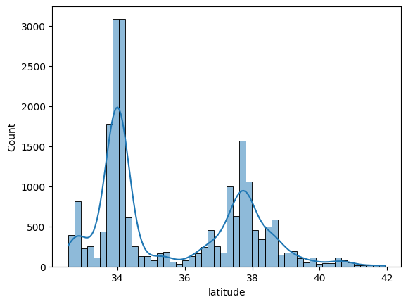
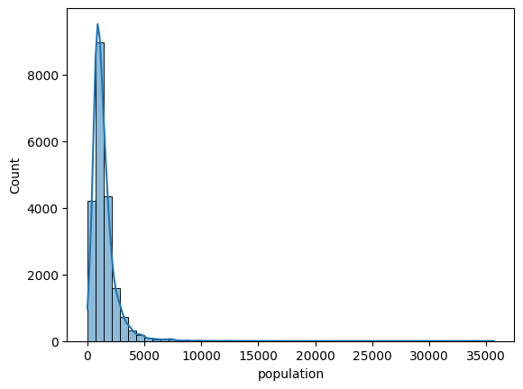
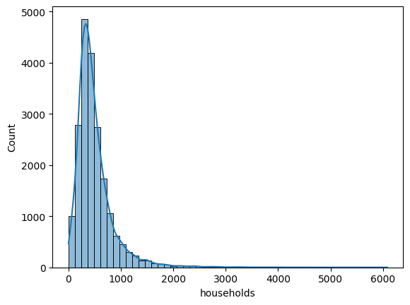
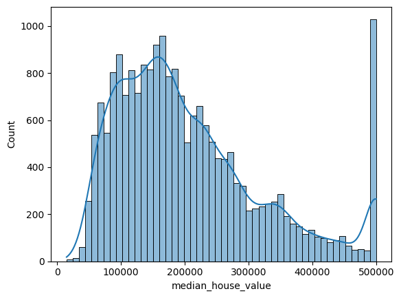
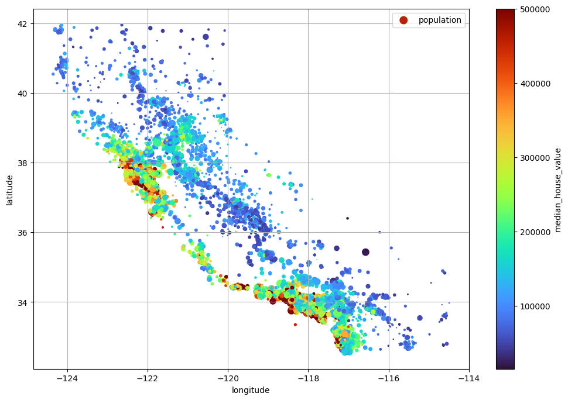
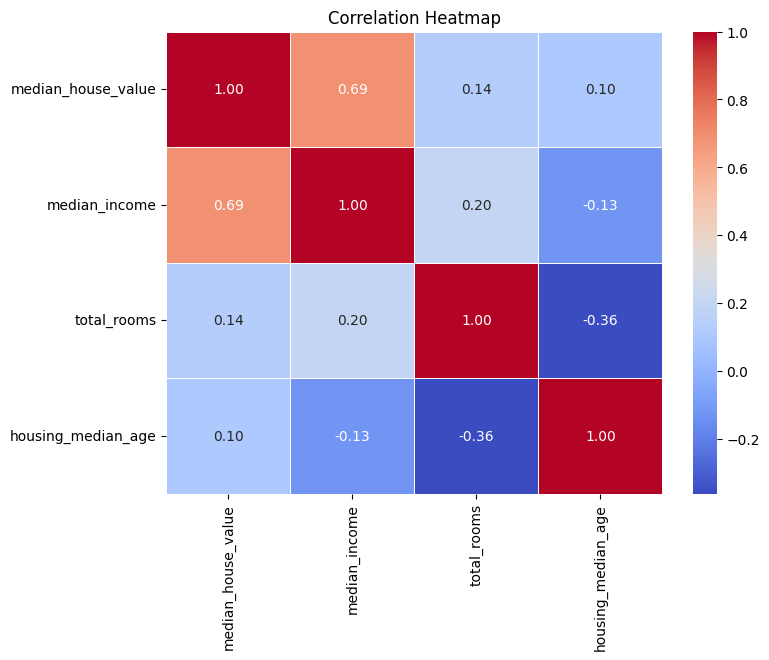

```python
import tarfile
import urllib.request
from pathlib import Path

import pandas as pd
import numpy as np
import matplotlib.pyplot as plt
import seaborn as sns
from sklearn.model_selection import train_test_split
from sklearn.preprocessing import OrdinalEncoder
```

```python
def load_housingdata():
    tarball_path = Path("datasets/housing.tgz")
    if not tarball_path.exists():
        Path("datasets").mkdir(parents=True, exist_ok=True)
        url = "https://github.com/ageron/data/raw/main/housing.tgz"
        urllib.request.urlretrieve(url, tarball_path)
        print("Downloaded housing dataset.")
        with tarfile.open(tarball_path) as housing_tarball:
            housing_tarball.extractall(path="datasets")
            print("Extracted housing dataset.")
    housing_csv_path = Path("datasets/housing/housing.csv")
    return pd.read_csv(housing_csv_path)

housing_df = load_housingdata()
housing_df.head()
```

<div>
<style scoped>
    .dataframe tbody tr th:only-of-type {
        vertical-align: middle;
    }

    .dataframe tbody tr th {
        vertical-align: top;
    }

    .dataframe thead th {
        text-align: right;
    }
</style>
<table border="1" class="dataframe">
  <thead>
    <tr style="text-align: right;">
      <th></th>
      <th>longitude</th>
      <th>latitude</th>
      <th>housing_median_age</th>
      <th>total_rooms</th>
      <th>total_bedrooms</th>
      <th>population</th>
      <th>households</th>
      <th>median_income</th>
      <th>median_house_value</th>
      <th>ocean_proximity</th>
    </tr>
  </thead>
  <tbody>
    <tr>
      <th>0</th>
      <td>-122.23</td>
      <td>37.88</td>
      <td>41.0</td>
      <td>880.0</td>
      <td>129.0</td>
      <td>322.0</td>
      <td>126.0</td>
      <td>8.3252</td>
      <td>452600.0</td>
      <td>NEAR BAY</td>
    </tr>
    <tr>
      <th>1</th>
      <td>-122.22</td>
      <td>37.86</td>
      <td>21.0</td>
      <td>7099.0</td>
      <td>1106.0</td>
      <td>2401.0</td>
      <td>1138.0</td>
      <td>8.3014</td>
      <td>358500.0</td>
      <td>NEAR BAY</td>
    </tr>
    <tr>
      <th>2</th>
      <td>-122.24</td>
      <td>37.85</td>
      <td>52.0</td>
      <td>1467.0</td>
      <td>190.0</td>
      <td>496.0</td>
      <td>177.0</td>
      <td>7.2574</td>
      <td>352100.0</td>
      <td>NEAR BAY</td>
    </tr>
    <tr>
      <th>3</th>
      <td>-122.25</td>
      <td>37.85</td>
      <td>52.0</td>
      <td>1274.0</td>
      <td>235.0</td>
      <td>558.0</td>
      <td>219.0</td>
      <td>5.6431</td>
      <td>341300.0</td>
      <td>NEAR BAY</td>
    </tr>
    <tr>
      <th>4</th>
      <td>-122.25</td>
      <td>37.85</td>
      <td>52.0</td>
      <td>1627.0</td>
      <td>280.0</td>
      <td>565.0</td>
      <td>259.0</td>
      <td>3.8462</td>
      <td>342200.0</td>
      <td>NEAR BAY</td>
    </tr>
  </tbody>
</table>
</div>

```python
housing_df.info()
housing_df.describe()
```

    <class 'pandas.core.frame.DataFrame'>
    RangeIndex: 20640 entries, 0 to 20639
    Data columns (total 10 columns):
     #   Column              Non-Null Count  Dtype  
    ---  ------              --------------  -----  
     0   longitude           20640 non-null  float64
     1   latitude            20640 non-null  float64
     2   housing_median_age  20640 non-null  float64
     3   total_rooms         20640 non-null  float64
     4   total_bedrooms      20433 non-null  float64
     5   population          20640 non-null  float64
     6   households          20640 non-null  float64
     7   median_income       20640 non-null  float64
     8   median_house_value  20640 non-null  float64
     9   ocean_proximity     20640 non-null  object 
    dtypes: float64(9), object(1)
    memory usage: 1.6+ MB

<div>
<style scoped>
    .dataframe tbody tr th:only-of-type {
        vertical-align: middle;
    }

    .dataframe tbody tr th {
        vertical-align: top;
    }

    .dataframe thead th {
        text-align: right;
    }
</style>
<table border="1" class="dataframe">
  <thead>
    <tr style="text-align: right;">
      <th></th>
      <th>longitude</th>
      <th>latitude</th>
      <th>housing_median_age</th>
      <th>total_rooms</th>
      <th>total_bedrooms</th>
      <th>population</th>
      <th>households</th>
      <th>median_income</th>
      <th>median_house_value</th>
    </tr>
  </thead>
  <tbody>
    <tr>
      <th>count</th>
      <td>20640.000000</td>
      <td>20640.000000</td>
      <td>20640.000000</td>
      <td>20640.000000</td>
      <td>20433.000000</td>
      <td>20640.000000</td>
      <td>20640.000000</td>
      <td>20640.000000</td>
      <td>20640.000000</td>
    </tr>
    <tr>
      <th>mean</th>
      <td>-119.569704</td>
      <td>35.631861</td>
      <td>28.639486</td>
      <td>2635.763081</td>
      <td>537.870553</td>
      <td>1425.476744</td>
      <td>499.539680</td>
      <td>3.870671</td>
      <td>206855.816909</td>
    </tr>
    <tr>
      <th>std</th>
      <td>2.003532</td>
      <td>2.135952</td>
      <td>12.585558</td>
      <td>2181.615252</td>
      <td>421.385070</td>
      <td>1132.462122</td>
      <td>382.329753</td>
      <td>1.899822</td>
      <td>115395.615874</td>
    </tr>
    <tr>
      <th>min</th>
      <td>-124.350000</td>
      <td>32.540000</td>
      <td>1.000000</td>
      <td>2.000000</td>
      <td>1.000000</td>
      <td>3.000000</td>
      <td>1.000000</td>
      <td>0.499900</td>
      <td>14999.000000</td>
    </tr>
    <tr>
      <th>25%</th>
      <td>-121.800000</td>
      <td>33.930000</td>
      <td>18.000000</td>
      <td>1447.750000</td>
      <td>296.000000</td>
      <td>787.000000</td>
      <td>280.000000</td>
      <td>2.563400</td>
      <td>119600.000000</td>
    </tr>
    <tr>
      <th>50%</th>
      <td>-118.490000</td>
      <td>34.260000</td>
      <td>29.000000</td>
      <td>2127.000000</td>
      <td>435.000000</td>
      <td>1166.000000</td>
      <td>409.000000</td>
      <td>3.534800</td>
      <td>179700.000000</td>
    </tr>
    <tr>
      <th>75%</th>
      <td>-118.010000</td>
      <td>37.710000</td>
      <td>37.000000</td>
      <td>3148.000000</td>
      <td>647.000000</td>
      <td>1725.000000</td>
      <td>605.000000</td>
      <td>4.743250</td>
      <td>264725.000000</td>
    </tr>
    <tr>
      <th>max</th>
      <td>-114.310000</td>
      <td>41.950000</td>
      <td>52.000000</td>
      <td>39320.000000</td>
      <td>6445.000000</td>
      <td>35682.000000</td>
      <td>6082.000000</td>
      <td>15.000100</td>
      <td>500001.000000</td>
    </tr>
  </tbody>
</table>
</div>

```python
housing_df['ocean_proximity'].value_counts()
```

    ocean_proximity
    <1H OCEAN     9136
    INLAND        6551
    NEAR OCEAN    2658
    NEAR BAY      2290
    ISLAND           5
    Name: count, dtype: int64

```python
# housing_df.hist(bins=50, figsize=(20,15))
# plt.show()
numeric_columns_df = housing_df.select_dtypes(include=[np.number])
numeric_columns = numeric_columns_df.columns

for i, column in enumerate(numeric_columns, 1):
    sns.histplot(data=housing_df[column], bins=50, kde=True)
    plt.show()
```

    

    

    

    

    

    

    

    

    

    

    

    

    

    

    

    

    

    

```python
housing_df['income_cat'] = pd.cut(
    housing_df['median_income'],
    bins=[0., 1.5, 3.0, 4.5, 6.0, np.inf],
    labels=[1, 2, 3, 4, 5]
)

plt.subplots( 1, 1, figsize=(12, 6))
housing_df['income_cat'].hist()
plt.show()
```

    

    

```python
strat_train_set, strat_test_set = train_test_split(
    housing_df,
    test_size=0.2,
    stratify=housing_df['income_cat'],
    random_state=42
)

strat_train_set["income_cat"].value_counts() / len(strat_train_set)
```

    income_cat
    3    0.350594
    2    0.318859
    4    0.176296
    5    0.114462
    1    0.039789
    Name: count, dtype: float64

```python
for set_ in (strat_train_set, strat_test_set):
    set_.drop("income_cat", axis=1, inplace=True)
```

```python
housing_c = strat_train_set.copy()
housing_c.plot(kind="scatter", x="longitude", y="latitude", alpha=0.2, grid=True)
plt.show()
```

    

    

```python
housing_c.plot(kind="scatter", x="longitude", y="latitude", grid=True,
                s=housing_c["population"]/100, label="population",
                c="median_house_value", cmap=plt.get_cmap("turbo"), colorbar=True,
                legend=True, sharex=False, figsize=(12,8))
plt.show()
```

    

    

```python
attributes = ["median_house_value", "median_income", "total_rooms", "housing_median_age"]

sns.pairplot(housing_c[attributes])

# Display the plot
plt.show()
```

    

    

```python
corr_matrix_numeric_columns = housing_c[attributes].corr()

plt.figure(figsize=(8, 6))

# 4. Plot the heatmap using Seaborn
sns.heatmap(corr_matrix_numeric_columns, 
            annot=True,      # Annotate cells with correlation values
            cmap='coolwarm', # Choose a color map (e.g., 'coolwarm', 'viridis')
            fmt=".2f",       # Format annotations to 2 decimal places
            linewidths=0.5   # Add lines to divide cells
           )

plt.title("Correlation Heatmap")
plt.show()
```

    

    

```python
housing = strat_train_set.drop("median_house_value", axis=1)
housing_labels = strat_train_set["median_house_value"].copy()
```

```python
from sklearn.pipeline import make_pipeline, Pipeline
from sklearn.impute import SimpleImputer
from sklearn.preprocessing import FunctionTransformer, StandardScaler
from sklearn.base import BaseEstimator, TransformerMixin
from sklearn.compose import ColumnTransformer, make_column_selector
from sklearn.metrics.pairwise import rbf_kernel
from sklearn.preprocessing import OneHotEncoder

from sklearn.cluster import KMeans

class ClusterSimilarity(BaseEstimator, TransformerMixin):
    def __init__(self, n_clusters=10, random_state=None, gamma=1.0):
        self.n_clusters = n_clusters
        self.random_state = random_state
        self.gamma = gamma
        self.kmeans = KMeans(n_clusters=self.n_clusters, random_state=self.random_state)

    def fit(self, X, y=None, sample_weight=None):
        self.kmeans.fit(X, sample_weight=sample_weight)
        return self

    def transform(self, X):
        return rbf_kernel(X, self.kmeans.cluster_centers_, gamma=self.gamma)

    def get_feature_names_out(self, input_features=None):
        return [f"cluster {i} similarity" for i in range(self.n_clusters)]

def column_ratio(x):
    return x[:, [0]] / x[:, [1]]

def ratio_name(function_transformer, feature_names_in):
    return ["ratio"]

def ratio_pipeline():
    return make_pipeline(
        SimpleImputer(strategy="median"),
        FunctionTransformer(column_ratio, feature_names_out=ratio_name),
        StandardScaler())

logging_pipeline = make_pipeline(
    SimpleImputer(strategy="median"),
    FunctionTransformer(np.log, feature_names_out="one-to-one"),
    StandardScaler())

cat_pipeline = make_pipeline(
    SimpleImputer(strategy="most_frequent"),
    OneHotEncoder(handle_unknown="ignore"))

cluster_simil = ClusterSimilarity(n_clusters=10, random_state=42, gamma=1.0)

default_num_pipeline = make_pipeline(
    SimpleImputer(strategy="median"),
    StandardScaler())

preprocessing = ColumnTransformer([
    ("bedrooms", ratio_pipeline(), ["total_bedrooms", "total_rooms"]),
    ("rooms_per_house", ratio_pipeline(), ["total_rooms", "households"]),
    ("people_per_household", ratio_pipeline(), ["population", "households"]),
    ("log", logging_pipeline, ["total_bedrooms", "total_rooms", "population", "households", "median_income"]),
    ("geo", cluster_simil, ["longitude", "latitude"]),
    ("cat", cat_pipeline, make_column_selector(dtype_include=object))
], remainder=default_num_pipeline)
```

```python
housing_prepared = preprocessing.fit_transform(housing)
housing_prepared.shape
```

    (16512, 24)

```python
preprocessing.get_feature_names_out()
```

    array(['bedrooms__ratio', 'rooms_per_house__ratio',
           'people_per_household__ratio', 'log__total_bedrooms',
           'log__total_rooms', 'log__population', 'log__households',
           'log__median_income', 'geo__cluster 0 similarity',
           'geo__cluster 1 similarity', 'geo__cluster 2 similarity',
           'geo__cluster 3 similarity', 'geo__cluster 4 similarity',
           'geo__cluster 5 similarity', 'geo__cluster 6 similarity',
           'geo__cluster 7 similarity', 'geo__cluster 8 similarity',
           'geo__cluster 9 similarity', 'cat__ocean_proximity_<1H OCEAN',
           'cat__ocean_proximity_INLAND', 'cat__ocean_proximity_ISLAND',
           'cat__ocean_proximity_NEAR BAY', 'cat__ocean_proximity_NEAR OCEAN',
           'remainder__housing_median_age'], dtype=object)

```python
from sklearn.linear_model import LinearRegression
from sklearn.metrics import mean_squared_error
lin_reg = make_pipeline(
    preprocessing,
    LinearRegression()
)
lin_reg.fit(housing, housing_labels)
housing_predictions = lin_reg.predict(housing)
lin_mse = mean_squared_error(housing_labels, housing_predictions)
print("RMSE:", np.sqrt(lin_mse))

mean_avg_error = np.mean(np.abs(housing_predictions - housing_labels))
print("MAE:", mean_avg_error)
```

    RMSE: 68972.88910758452
    MAE: 51301.0044458925

```python
from sklearn.tree import DecisionTreeRegressor

tree_reg = make_pipeline(
    preprocessing,
    DecisionTreeRegressor(random_state=42)
)
tree_reg.fit(housing, housing_labels)
housing_predictions_tree = tree_reg.predict(housing)
tree_mse = mean_squared_error(housing_labels, housing_predictions_tree)
print("RMSE:", np.sqrt(tree_mse))
mean_avg_error_tree = np.mean(np.abs(housing_predictions_tree - housing_labels))
print("MAE:", mean_avg_error_tree)
```

    RMSE: 0.0
    MAE: 0.0

```python
from sklearn.model_selection import cross_val_score
scores = -cross_val_score(
    tree_reg,
    housing,
    housing_labels,
    scoring="neg_root_mean_squared_error",
    cv=10
)

print("Scores:", scores)
print("Mean:", scores.mean())
```

    Scores: [64607.89604624 66409.0627187  66203.41031283 65863.76434319
     68086.79141027 66534.53308312 66923.49892937 68532.21066423
     66367.48227837 66208.69621463]
    Mean: 66573.73460009348

```python
from sklearn.ensemble import RandomForestRegressor
forest_reg = make_pipeline(
    preprocessing,
    RandomForestRegressor(random_state=42)
)
forest_rmse_scores = -cross_val_score(
    forest_reg,
    housing,
    housing_labels,
    scoring="neg_root_mean_squared_error",
    cv=10
)
print("Scores:", forest_rmse_scores)
print("Mean:", forest_rmse_scores.mean())
```

    Scores: [46576.85817312 47238.61187815 45495.97664925 46488.27129295
     45911.17628527 47730.60806253 47561.15494003 49140.83221016
     47121.06435179 47116.37414628]
    Mean: 47038.09279895258

```python
from sklearn.model_selection import GridSearchCV

full_pipeline = Pipeline([
    ("preprocessing", preprocessing),
    ("random_forest", RandomForestRegressor(random_state=42))
])
param_grid = [
    {'preprocessing__geo__n_clusters': [5, 8, 10],
    'random_forest__max_features': [4, 6, 8]},
    {'preprocessing__geo__n_clusters': [10, 15],
    'random_forest__max_features': [6, 8, 10]},
]

grid_search = GridSearchCV(full_pipeline, param_grid, cv=3, scoring='neg_root_mean_squared_error')
grid_search.fit(housing, housing_labels)
```

<style>#sk-container-id-1 {
  /* Definition of color scheme common for light and dark mode */
  --sklearn-color-text: #000;
  --sklearn-color-text-muted: #666;
  --sklearn-color-line: gray;
  /* Definition of color scheme for unfitted estimators */
  --sklearn-color-unfitted-level-0: #fff5e6;
  --sklearn-color-unfitted-level-1: #f6e4d2;
  --sklearn-color-unfitted-level-2: #ffe0b3;
  --sklearn-color-unfitted-level-3: chocolate;
  /* Definition of color scheme for fitted estimators */
  --sklearn-color-fitted-level-0: #f0f8ff;
  --sklearn-color-fitted-level-1: #d4ebff;
  --sklearn-color-fitted-level-2: #b3dbfd;
  --sklearn-color-fitted-level-3: cornflowerblue;

  /* Specific color for light theme */
  --sklearn-color-text-on-default-background: var(--sg-text-color, var(--theme-code-foreground, var(--jp-content-font-color1, black)));
  --sklearn-color-background: var(--sg-background-color, var(--theme-background, var(--jp-layout-color0, white)));
  --sklearn-color-border-box: var(--sg-text-color, var(--theme-code-foreground, var(--jp-content-font-color1, black)));
  --sklearn-color-icon: #696969;

  @media (prefers-color-scheme: dark) {
    /* Redefinition of color scheme for dark theme */
    --sklearn-color-text-on-default-background: var(--sg-text-color, var(--theme-code-foreground, var(--jp-content-font-color1, white)));
    --sklearn-color-background: var(--sg-background-color, var(--theme-background, var(--jp-layout-color0, #111)));
    --sklearn-color-border-box: var(--sg-text-color, var(--theme-code-foreground, var(--jp-content-font-color1, white)));
    --sklearn-color-icon: #878787;
  }
}

#sk-container-id-1 {
  color: var(--sklearn-color-text);
}

#sk-container-id-1 pre {
  padding: 0;
}

#sk-container-id-1 input.sk-hidden--visually {
  border: 0;
  clip: rect(1px 1px 1px 1px);
  clip: rect(1px, 1px, 1px, 1px);
  height: 1px;
  margin: -1px;
  overflow: hidden;
  padding: 0;
  position: absolute;
  width: 1px;
}

#sk-container-id-1 div.sk-dashed-wrapped {
  border: 1px dashed var(--sklearn-color-line);
  margin: 0 0.4em 0.5em 0.4em;
  box-sizing: border-box;
  padding-bottom: 0.4em;
  background-color: var(--sklearn-color-background);
}

#sk-container-id-1 div.sk-container {
  /* jupyter's `normalize.less` sets `[hidden] { display: none; }`
     but bootstrap.min.css set `[hidden] { display: none !important; }`
     so we also need the `!important` here to be able to override the
     default hidden behavior on the sphinx rendered scikit-learn.org.
     See: https://github.com/scikit-learn/scikit-learn/issues/21755 */
  display: inline-block !important;
  position: relative;
}

#sk-container-id-1 div.sk-text-repr-fallback {
  display: none;
}

div.sk-parallel-item,
div.sk-serial,
div.sk-item {
  /* draw centered vertical line to link estimators */
  background-image: linear-gradient(var(--sklearn-color-text-on-default-background), var(--sklearn-color-text-on-default-background));
  background-size: 2px 100%;
  background-repeat: no-repeat;
  background-position: center center;
}

/* Parallel-specific style estimator block */

#sk-container-id-1 div.sk-parallel-item::after {
  content: "";
  width: 100%;
  border-bottom: 2px solid var(--sklearn-color-text-on-default-background);
  flex-grow: 1;
}

#sk-container-id-1 div.sk-parallel {
  display: flex;
  align-items: stretch;
  justify-content: center;
  background-color: var(--sklearn-color-background);
  position: relative;
}

#sk-container-id-1 div.sk-parallel-item {
  display: flex;
  flex-direction: column;
}

#sk-container-id-1 div.sk-parallel-item:first-child::after {
  align-self: flex-end;
  width: 50%;
}

#sk-container-id-1 div.sk-parallel-item:last-child::after {
  align-self: flex-start;
  width: 50%;
}

#sk-container-id-1 div.sk-parallel-item:only-child::after {
  width: 0;
}

/* Serial-specific style estimator block */

#sk-container-id-1 div.sk-serial {
  display: flex;
  flex-direction: column;
  align-items: center;
  background-color: var(--sklearn-color-background);
  padding-right: 1em;
  padding-left: 1em;
}

/* Toggleable style: style used for estimator/Pipeline/ColumnTransformer box that is
clickable and can be expanded/collapsed.
- Pipeline and ColumnTransformer use this feature and define the default style
- Estimators will overwrite some part of the style using the `sk-estimator` class
*/

/* Pipeline and ColumnTransformer style (default) */

#sk-container-id-1 div.sk-toggleable {
  /* Default theme specific background. It is overwritten whether we have a
  specific estimator or a Pipeline/ColumnTransformer */
  background-color: var(--sklearn-color-background);
}

/* Toggleable label */
#sk-container-id-1 label.sk-toggleable__label {
  cursor: pointer;
  display: flex;
  width: 100%;
  margin-bottom: 0;
  padding: 0.5em;
  box-sizing: border-box;
  text-align: center;
  align-items: start;
  justify-content: space-between;
  gap: 0.5em;
}

#sk-container-id-1 label.sk-toggleable__label .caption {
  font-size: 0.6rem;
  font-weight: lighter;
  color: var(--sklearn-color-text-muted);
}

#sk-container-id-1 label.sk-toggleable__label-arrow:before {
  /* Arrow on the left of the label */
  content: "▸";
  float: left;
  margin-right: 0.25em;
  color: var(--sklearn-color-icon);
}

#sk-container-id-1 label.sk-toggleable__label-arrow:hover:before {
  color: var(--sklearn-color-text);
}

/* Toggleable content - dropdown */

#sk-container-id-1 div.sk-toggleable__content {
  display: none;
  text-align: left;
  /* unfitted */
  background-color: var(--sklearn-color-unfitted-level-0);
}

#sk-container-id-1 div.sk-toggleable__content.fitted {
  /* fitted */
  background-color: var(--sklearn-color-fitted-level-0);
}

#sk-container-id-1 div.sk-toggleable__content pre {
  margin: 0.2em;
  border-radius: 0.25em;
  color: var(--sklearn-color-text);
  /* unfitted */
  background-color: var(--sklearn-color-unfitted-level-0);
}

#sk-container-id-1 div.sk-toggleable__content.fitted pre {
  /* unfitted */
  background-color: var(--sklearn-color-fitted-level-0);
}

#sk-container-id-1 input.sk-toggleable__control:checked~div.sk-toggleable__content {
  /* Expand drop-down */
  display: block;
  width: 100%;
  overflow: visible;
}

#sk-container-id-1 input.sk-toggleable__control:checked~label.sk-toggleable__label-arrow:before {
  content: "▾";
}

/* Pipeline/ColumnTransformer-specific style */

#sk-container-id-1 div.sk-label input.sk-toggleable__control:checked~label.sk-toggleable__label {
  color: var(--sklearn-color-text);
  background-color: var(--sklearn-color-unfitted-level-2);
}

#sk-container-id-1 div.sk-label.fitted input.sk-toggleable__control:checked~label.sk-toggleable__label {
  background-color: var(--sklearn-color-fitted-level-2);
}

/* Estimator-specific style */

/* Colorize estimator box */
#sk-container-id-1 div.sk-estimator input.sk-toggleable__control:checked~label.sk-toggleable__label {
  /* unfitted */
  background-color: var(--sklearn-color-unfitted-level-2);
}

#sk-container-id-1 div.sk-estimator.fitted input.sk-toggleable__control:checked~label.sk-toggleable__label {
  /* fitted */
  background-color: var(--sklearn-color-fitted-level-2);
}

#sk-container-id-1 div.sk-label label.sk-toggleable__label,
#sk-container-id-1 div.sk-label label {
  /* The background is the default theme color */
  color: var(--sklearn-color-text-on-default-background);
}

/* On hover, darken the color of the background */
#sk-container-id-1 div.sk-label:hover label.sk-toggleable__label {
  color: var(--sklearn-color-text);
  background-color: var(--sklearn-color-unfitted-level-2);
}

/* Label box, darken color on hover, fitted */
#sk-container-id-1 div.sk-label.fitted:hover label.sk-toggleable__label.fitted {
  color: var(--sklearn-color-text);
  background-color: var(--sklearn-color-fitted-level-2);
}

/* Estimator label */

#sk-container-id-1 div.sk-label label {
  font-family: monospace;
  font-weight: bold;
  display: inline-block;
  line-height: 1.2em;
}

#sk-container-id-1 div.sk-label-container {
  text-align: center;
}

/* Estimator-specific */
#sk-container-id-1 div.sk-estimator {
  font-family: monospace;
  border: 1px dotted var(--sklearn-color-border-box);
  border-radius: 0.25em;
  box-sizing: border-box;
  margin-bottom: 0.5em;
  /* unfitted */
  background-color: var(--sklearn-color-unfitted-level-0);
}

#sk-container-id-1 div.sk-estimator.fitted {
  /* fitted */
  background-color: var(--sklearn-color-fitted-level-0);
}

/* on hover */
#sk-container-id-1 div.sk-estimator:hover {
  /* unfitted */
  background-color: var(--sklearn-color-unfitted-level-2);
}

#sk-container-id-1 div.sk-estimator.fitted:hover {
  /* fitted */
  background-color: var(--sklearn-color-fitted-level-2);
}

/* Specification for estimator info (e.g. "i" and "?") */

/* Common style for "i" and "?" */

.sk-estimator-doc-link,
a:link.sk-estimator-doc-link,
a:visited.sk-estimator-doc-link {
  float: right;
  font-size: smaller;
  line-height: 1em;
  font-family: monospace;
  background-color: var(--sklearn-color-background);
  border-radius: 1em;
  height: 1em;
  width: 1em;
  text-decoration: none !important;
  margin-left: 0.5em;
  text-align: center;
  /* unfitted */
  border: var(--sklearn-color-unfitted-level-1) 1pt solid;
  color: var(--sklearn-color-unfitted-level-1);
}

.sk-estimator-doc-link.fitted,
a:link.sk-estimator-doc-link.fitted,
a:visited.sk-estimator-doc-link.fitted {
  /* fitted */
  border: var(--sklearn-color-fitted-level-1) 1pt solid;
  color: var(--sklearn-color-fitted-level-1);
}

/* On hover */
div.sk-estimator:hover .sk-estimator-doc-link:hover,
.sk-estimator-doc-link:hover,
div.sk-label-container:hover .sk-estimator-doc-link:hover,
.sk-estimator-doc-link:hover {
  /* unfitted */
  background-color: var(--sklearn-color-unfitted-level-3);
  color: var(--sklearn-color-background);
  text-decoration: none;
}

div.sk-estimator.fitted:hover .sk-estimator-doc-link.fitted:hover,
.sk-estimator-doc-link.fitted:hover,
div.sk-label-container:hover .sk-estimator-doc-link.fitted:hover,
.sk-estimator-doc-link.fitted:hover {
  /* fitted */
  background-color: var(--sklearn-color-fitted-level-3);
  color: var(--sklearn-color-background);
  text-decoration: none;
}

/* Span, style for the box shown on hovering the info icon */
.sk-estimator-doc-link span {
  display: none;
  z-index: 9999;
  position: relative;
  font-weight: normal;
  right: .2ex;
  padding: .5ex;
  margin: .5ex;
  width: min-content;
  min-width: 20ex;
  max-width: 50ex;
  color: var(--sklearn-color-text);
  box-shadow: 2pt 2pt 4pt #999;
  /* unfitted */
  background: var(--sklearn-color-unfitted-level-0);
  border: .5pt solid var(--sklearn-color-unfitted-level-3);
}

.sk-estimator-doc-link.fitted span {
  /* fitted */
  background: var(--sklearn-color-fitted-level-0);
  border: var(--sklearn-color-fitted-level-3);
}

.sk-estimator-doc-link:hover span {
  display: block;
}

/* "?"-specific style due to the `<a>` HTML tag */

#sk-container-id-1 a.estimator_doc_link {
  float: right;
  font-size: 1rem;
  line-height: 1em;
  font-family: monospace;
  background-color: var(--sklearn-color-background);
  border-radius: 1rem;
  height: 1rem;
  width: 1rem;
  text-decoration: none;
  /* unfitted */
  color: var(--sklearn-color-unfitted-level-1);
  border: var(--sklearn-color-unfitted-level-1) 1pt solid;
}

#sk-container-id-1 a.estimator_doc_link.fitted {
  /* fitted */
  border: var(--sklearn-color-fitted-level-1) 1pt solid;
  color: var(--sklearn-color-fitted-level-1);
}

/* On hover */
#sk-container-id-1 a.estimator_doc_link:hover {
  /* unfitted */
  background-color: var(--sklearn-color-unfitted-level-3);
  color: var(--sklearn-color-background);
  text-decoration: none;
}

#sk-container-id-1 a.estimator_doc_link.fitted:hover {
  /* fitted */
  background-color: var(--sklearn-color-fitted-level-3);
}

.estimator-table summary {
    padding: .5rem;
    font-family: monospace;
    cursor: pointer;
}

.estimator-table details[open] {
    padding-left: 0.1rem;
    padding-right: 0.1rem;
    padding-bottom: 0.3rem;
}

.estimator-table .parameters-table {
    margin-left: auto !important;
    margin-right: auto !important;
}

.estimator-table .parameters-table tr:nth-child(odd) {
    background-color: #fff;
}

.estimator-table .parameters-table tr:nth-child(even) {
    background-color: #f6f6f6;
}

.estimator-table .parameters-table tr:hover {
    background-color: #e0e0e0;
}

.estimator-table table td {
    border: 1px solid rgba(106, 105, 104, 0.232);
}

.user-set td {
    color:rgb(255, 94, 0);
    text-align: left;
}

.user-set td.value pre {
    color:rgb(255, 94, 0) !important;
    background-color: transparent !important;
}

.default td {
    color: black;
    text-align: left;
}

.user-set td i,
.default td i {
    color: black;
}

.copy-paste-icon {
    background-image: url(data:image/svg+xml;base64,PHN2ZyB4bWxucz0iaHR0cDovL3d3dy53My5vcmcvMjAwMC9zdmciIHZpZXdCb3g9IjAgMCA0NDggNTEyIj48IS0tIUZvbnQgQXdlc29tZSBGcmVlIDYuNy4yIGJ5IEBmb250YXdlc29tZSAtIGh0dHBzOi8vZm9udGF3ZXNvbWUuY29tIExpY2Vuc2UgLSBodHRwczovL2ZvbnRhd2Vzb21lLmNvbS9saWNlbnNlL2ZyZWUgQ29weXJpZ2h0IDIwMjUgRm9udGljb25zLCBJbmMuLS0+PHBhdGggZD0iTTIwOCAwTDMzMi4xIDBjMTIuNyAwIDI0LjkgNS4xIDMzLjkgMTQuMWw2Ny45IDY3LjljOSA5IDE0LjEgMjEuMiAxNC4xIDMzLjlMNDQ4IDMzNmMwIDI2LjUtMjEuNSA0OC00OCA0OGwtMTkyIDBjLTI2LjUgMC00OC0yMS41LTQ4LTQ4bDAtMjg4YzAtMjYuNSAyMS41LTQ4IDQ4LTQ4ek00OCAxMjhsODAgMCAwIDY0LTY0IDAgMCAyNTYgMTkyIDAgMC0zMiA2NCAwIDAgNDhjMCAyNi41LTIxLjUgNDgtNDggNDhMNDggNTEyYy0yNi41IDAtNDgtMjEuNS00OC00OEwwIDE3NmMwLTI2LjUgMjEuNS00OCA0OC00OHoiLz48L3N2Zz4=);
    background-repeat: no-repeat;
    background-size: 14px 14px;
    background-position: 0;
    display: inline-block;
    width: 14px;
    height: 14px;
    cursor: pointer;
}
</style><body><div id="sk-container-id-1" class="sk-top-container"><div class="sk-text-repr-fallback"><pre>GridSearchCV(cv=3,
             estimator=Pipeline(steps=[(&#x27;preprocessing&#x27;,
                                        ColumnTransformer(remainder=Pipeline(steps=[(&#x27;simpleimputer&#x27;,
                                                                                     SimpleImputer(strategy=&#x27;median&#x27;)),
                                                                                    (&#x27;standardscaler&#x27;,
                                                                                     StandardScaler())]),
                                                          transformers=[(&#x27;bedrooms&#x27;,
                                                                         Pipeline(steps=[(&#x27;simpleimputer&#x27;,
                                                                                          SimpleImputer(strategy=&#x27;median&#x27;)),
                                                                                         (&#x27;functiontransformer&#x27;,
                                                                                          FunctionTransformer(feature_names_out=&lt;f...
                                                                         &lt;sklearn.compose._column_transformer.make_column_selector object at 0x00000216643850D0&gt;)])),
                                       (&#x27;random_forest&#x27;,
                                        RandomForestRegressor(random_state=42))]),
             param_grid=[{&#x27;preprocessing__geo__n_clusters&#x27;: [5, 8, 10],
                          &#x27;random_forest__max_features&#x27;: [4, 6, 8]},
                         {&#x27;preprocessing__geo__n_clusters&#x27;: [10, 15],
                          &#x27;random_forest__max_features&#x27;: [6, 8, 10]}],
             scoring=&#x27;neg_root_mean_squared_error&#x27;)</pre><b>In a Jupyter environment, please rerun this cell to show the HTML representation or trust the notebook. <br />On GitHub, the HTML representation is unable to render, please try loading this page with nbviewer.org.</b></div><div class="sk-container" hidden><div class="sk-item sk-dashed-wrapped"><div class="sk-label-container"><div class="sk-label fitted sk-toggleable"><input class="sk-toggleable__control sk-hidden--visually" id="sk-estimator-id-1" type="checkbox" ><label for="sk-estimator-id-1" class="sk-toggleable__label fitted sk-toggleable__label-arrow"><div><div>GridSearchCV</div></div><div><a class="sk-estimator-doc-link fitted" rel="noreferrer" target="_blank" href="https://scikit-learn.org/1.7/modules/generated/sklearn.model_selection.GridSearchCV.html">?<span>Documentation for GridSearchCV</span></a><span class="sk-estimator-doc-link fitted">i<span>Fitted</span></span></div></label><div class="sk-toggleable__content fitted" data-param-prefix="">
        <div class="estimator-table">
            <details>
                <summary>Parameters</summary>
                <table class="parameters-table">
                  <tbody>

        <tr class="user-set">
            <td><i class="copy-paste-icon"
                 onclick="copyToClipboard('estimator',
                          this.parentElement.nextElementSibling)"
            ></i></td>
            <td class="param">estimator&nbsp;</td>
            <td class="value">Pipeline(step...m_state=42))])</td>
        </tr>

        <tr class="user-set">
            <td><i class="copy-paste-icon"
                 onclick="copyToClipboard('param_grid',
                          this.parentElement.nextElementSibling)"
            ></i></td>
            <td class="param">param_grid&nbsp;</td>
            <td class="value">[{&#x27;preprocessing__geo__n_clusters&#x27;: [5, 8, ...], &#x27;random_forest__max_features&#x27;: [4, 6, ...]}, {&#x27;preprocessing__geo__n_clusters&#x27;: [10, 15], &#x27;random_forest__max_features&#x27;: [6, 8, ...]}]</td>
        </tr>

        <tr class="user-set">
            <td><i class="copy-paste-icon"
                 onclick="copyToClipboard('scoring',
                          this.parentElement.nextElementSibling)"
            ></i></td>
            <td class="param">scoring&nbsp;</td>
            <td class="value">&#x27;neg_root_mean_squared_error&#x27;</td>
        </tr>

        <tr class="default">
            <td><i class="copy-paste-icon"
                 onclick="copyToClipboard('n_jobs',
                          this.parentElement.nextElementSibling)"
            ></i></td>
            <td class="param">n_jobs&nbsp;</td>
            <td class="value">None</td>
        </tr>

        <tr class="default">
            <td><i class="copy-paste-icon"
                 onclick="copyToClipboard('refit',
                          this.parentElement.nextElementSibling)"
            ></i></td>
            <td class="param">refit&nbsp;</td>
            <td class="value">True</td>
        </tr>

        <tr class="user-set">
            <td><i class="copy-paste-icon"
                 onclick="copyToClipboard('cv',
                          this.parentElement.nextElementSibling)"
            ></i></td>
            <td class="param">cv&nbsp;</td>
            <td class="value">3</td>
        </tr>

        <tr class="default">
            <td><i class="copy-paste-icon"
                 onclick="copyToClipboard('verbose',
                          this.parentElement.nextElementSibling)"
            ></i></td>
            <td class="param">verbose&nbsp;</td>
            <td class="value">0</td>
        </tr>

        <tr class="default">
            <td><i class="copy-paste-icon"
                 onclick="copyToClipboard('pre_dispatch',
                          this.parentElement.nextElementSibling)"
            ></i></td>
            <td class="param">pre_dispatch&nbsp;</td>
            <td class="value">&#x27;2*n_jobs&#x27;</td>
        </tr>

        <tr class="default">
            <td><i class="copy-paste-icon"
                 onclick="copyToClipboard('error_score',
                          this.parentElement.nextElementSibling)"
            ></i></td>
            <td class="param">error_score&nbsp;</td>
            <td class="value">nan</td>
        </tr>

        <tr class="default">
            <td><i class="copy-paste-icon"
                 onclick="copyToClipboard('return_train_score',
                          this.parentElement.nextElementSibling)"
            ></i></td>
            <td class="param">return_train_score&nbsp;</td>
            <td class="value">False</td>
        </tr>

                  </tbody>
                </table>
            </details>
        </div>
    </div></div></div><div class="sk-parallel"><div class="sk-parallel-item"><div class="sk-item"><div class="sk-label-container"><div class="sk-label fitted sk-toggleable"><input class="sk-toggleable__control sk-hidden--visually" id="sk-estimator-id-2" type="checkbox" ><label for="sk-estimator-id-2" class="sk-toggleable__label fitted sk-toggleable__label-arrow"><div><div>best_estimator_: Pipeline</div></div></label><div class="sk-toggleable__content fitted" data-param-prefix="best_estimator___"></div></div><div class="sk-serial"><div class="sk-item"><div class="sk-serial"><div class="sk-item sk-dashed-wrapped"><div class="sk-label-container"><div class="sk-label fitted sk-toggleable"><input class="sk-toggleable__control sk-hidden--visually" id="sk-estimator-id-3" type="checkbox" ><label for="sk-estimator-id-3" class="sk-toggleable__label fitted sk-toggleable__label-arrow"><div><div>preprocessing: ColumnTransformer</div></div><div><a class="sk-estimator-doc-link fitted" rel="noreferrer" target="_blank" href="https://scikit-learn.org/1.7/modules/generated/sklearn.compose.ColumnTransformer.html">?<span>Documentation for preprocessing: ColumnTransformer</span></a></div></label><div class="sk-toggleable__content fitted" data-param-prefix="best_estimator___preprocessing__">
        <div class="estimator-table">
            <details>
                <summary>Parameters</summary>
                <table class="parameters-table">
                  <tbody>

        <tr class="user-set">
            <td><i class="copy-paste-icon"
                 onclick="copyToClipboard('transformers',
                          this.parentElement.nextElementSibling)"
            ></i></td>
            <td class="param">transformers&nbsp;</td>
            <td class="value">[(&#x27;bedrooms&#x27;, ...), (&#x27;rooms_per_house&#x27;, ...), ...]</td>
        </tr>

        <tr class="user-set">
            <td><i class="copy-paste-icon"
                 onclick="copyToClipboard('remainder',
                          this.parentElement.nextElementSibling)"
            ></i></td>
            <td class="param">remainder&nbsp;</td>
            <td class="value">Pipeline(step...ardScaler())])</td>
        </tr>

        <tr class="default">
            <td><i class="copy-paste-icon"
                 onclick="copyToClipboard('sparse_threshold',
                          this.parentElement.nextElementSibling)"
            ></i></td>
            <td class="param">sparse_threshold&nbsp;</td>
            <td class="value">0.3</td>
        </tr>

        <tr class="default">
            <td><i class="copy-paste-icon"
                 onclick="copyToClipboard('n_jobs',
                          this.parentElement.nextElementSibling)"
            ></i></td>
            <td class="param">n_jobs&nbsp;</td>
            <td class="value">None</td>
        </tr>

        <tr class="default">
            <td><i class="copy-paste-icon"
                 onclick="copyToClipboard('transformer_weights',
                          this.parentElement.nextElementSibling)"
            ></i></td>
            <td class="param">transformer_weights&nbsp;</td>
            <td class="value">None</td>
        </tr>

        <tr class="default">
            <td><i class="copy-paste-icon"
                 onclick="copyToClipboard('verbose',
                          this.parentElement.nextElementSibling)"
            ></i></td>
            <td class="param">verbose&nbsp;</td>
            <td class="value">False</td>
        </tr>

        <tr class="default">
            <td><i class="copy-paste-icon"
                 onclick="copyToClipboard('verbose_feature_names_out',
                          this.parentElement.nextElementSibling)"
            ></i></td>
            <td class="param">verbose_feature_names_out&nbsp;</td>
            <td class="value">True</td>
        </tr>

        <tr class="default">
            <td><i class="copy-paste-icon"
                 onclick="copyToClipboard('force_int_remainder_cols',
                          this.parentElement.nextElementSibling)"
            ></i></td>
            <td class="param">force_int_remainder_cols&nbsp;</td>
            <td class="value">&#x27;deprecated&#x27;</td>
        </tr>

                  </tbody>
                </table>
            </details>
        </div>
    </div></div></div><div class="sk-parallel"><div class="sk-parallel-item"><div class="sk-item"><div class="sk-label-container"><div class="sk-label fitted sk-toggleable"><input class="sk-toggleable__control sk-hidden--visually" id="sk-estimator-id-4" type="checkbox" ><label for="sk-estimator-id-4" class="sk-toggleable__label fitted sk-toggleable__label-arrow"><div><div>bedrooms</div></div></label><div class="sk-toggleable__content fitted" data-param-prefix="best_estimator___preprocessing__bedrooms__"><pre>[&#x27;total_bedrooms&#x27;, &#x27;total_rooms&#x27;]</pre></div></div></div><div class="sk-serial"><div class="sk-item"><div class="sk-serial"><div class="sk-item"><div class="sk-estimator fitted sk-toggleable"><input class="sk-toggleable__control sk-hidden--visually" id="sk-estimator-id-5" type="checkbox" ><label for="sk-estimator-id-5" class="sk-toggleable__label fitted sk-toggleable__label-arrow"><div><div>SimpleImputer</div></div><div><a class="sk-estimator-doc-link fitted" rel="noreferrer" target="_blank" href="https://scikit-learn.org/1.7/modules/generated/sklearn.impute.SimpleImputer.html">?<span>Documentation for SimpleImputer</span></a></div></label><div class="sk-toggleable__content fitted" data-param-prefix="best_estimator___preprocessing__bedrooms__simpleimputer__">
        <div class="estimator-table">
            <details>
                <summary>Parameters</summary>
                <table class="parameters-table">
                  <tbody>

        <tr class="default">
            <td><i class="copy-paste-icon"
                 onclick="copyToClipboard('missing_values',
                          this.parentElement.nextElementSibling)"
            ></i></td>
            <td class="param">missing_values&nbsp;</td>
            <td class="value">nan</td>
        </tr>

        <tr class="user-set">
            <td><i class="copy-paste-icon"
                 onclick="copyToClipboard('strategy',
                          this.parentElement.nextElementSibling)"
            ></i></td>
            <td class="param">strategy&nbsp;</td>
            <td class="value">&#x27;median&#x27;</td>
        </tr>

        <tr class="default">
            <td><i class="copy-paste-icon"
                 onclick="copyToClipboard('fill_value',
                          this.parentElement.nextElementSibling)"
            ></i></td>
            <td class="param">fill_value&nbsp;</td>
            <td class="value">None</td>
        </tr>

        <tr class="default">
            <td><i class="copy-paste-icon"
                 onclick="copyToClipboard('copy',
                          this.parentElement.nextElementSibling)"
            ></i></td>
            <td class="param">copy&nbsp;</td>
            <td class="value">True</td>
        </tr>

        <tr class="default">
            <td><i class="copy-paste-icon"
                 onclick="copyToClipboard('add_indicator',
                          this.parentElement.nextElementSibling)"
            ></i></td>
            <td class="param">add_indicator&nbsp;</td>
            <td class="value">False</td>
        </tr>

        <tr class="default">
            <td><i class="copy-paste-icon"
                 onclick="copyToClipboard('keep_empty_features',
                          this.parentElement.nextElementSibling)"
            ></i></td>
            <td class="param">keep_empty_features&nbsp;</td>
            <td class="value">False</td>
        </tr>

                  </tbody>
                </table>
            </details>
        </div>
    </div></div></div><div class="sk-item"><div class="sk-estimator fitted sk-toggleable"><input class="sk-toggleable__control sk-hidden--visually" id="sk-estimator-id-6" type="checkbox" ><label for="sk-estimator-id-6" class="sk-toggleable__label fitted sk-toggleable__label-arrow"><div><div>column_ratio</div><div class="caption">FunctionTransformer</div></div><div><a class="sk-estimator-doc-link fitted" rel="noreferrer" target="_blank" href="https://scikit-learn.org/1.7/modules/generated/sklearn.preprocessing.FunctionTransformer.html">?<span>Documentation for FunctionTransformer</span></a></div></label><div class="sk-toggleable__content fitted" data-param-prefix="best_estimator___preprocessing__bedrooms__functiontransformer__">
        <div class="estimator-table">
            <details>
                <summary>Parameters</summary>
                <table class="parameters-table">
                  <tbody>

        <tr class="user-set">
            <td><i class="copy-paste-icon"
                 onclick="copyToClipboard('func',
                          this.parentElement.nextElementSibling)"
            ></i></td>
            <td class="param">func&nbsp;</td>
            <td class="value">&lt;function col...0021665884B80&gt;</td>
        </tr>

        <tr class="default">
            <td><i class="copy-paste-icon"
                 onclick="copyToClipboard('inverse_func',
                          this.parentElement.nextElementSibling)"
            ></i></td>
            <td class="param">inverse_func&nbsp;</td>
            <td class="value">None</td>
        </tr>

        <tr class="default">
            <td><i class="copy-paste-icon"
                 onclick="copyToClipboard('validate',
                          this.parentElement.nextElementSibling)"
            ></i></td>
            <td class="param">validate&nbsp;</td>
            <td class="value">False</td>
        </tr>

        <tr class="default">
            <td><i class="copy-paste-icon"
                 onclick="copyToClipboard('accept_sparse',
                          this.parentElement.nextElementSibling)"
            ></i></td>
            <td class="param">accept_sparse&nbsp;</td>
            <td class="value">False</td>
        </tr>

        <tr class="default">
            <td><i class="copy-paste-icon"
                 onclick="copyToClipboard('check_inverse',
                          this.parentElement.nextElementSibling)"
            ></i></td>
            <td class="param">check_inverse&nbsp;</td>
            <td class="value">True</td>
        </tr>

        <tr class="user-set">
            <td><i class="copy-paste-icon"
                 onclick="copyToClipboard('feature_names_out',
                          this.parentElement.nextElementSibling)"
            ></i></td>
            <td class="param">feature_names_out&nbsp;</td>
            <td class="value">&lt;function rat...0021666E474C0&gt;</td>
        </tr>

        <tr class="default">
            <td><i class="copy-paste-icon"
                 onclick="copyToClipboard('kw_args',
                          this.parentElement.nextElementSibling)"
            ></i></td>
            <td class="param">kw_args&nbsp;</td>
            <td class="value">None</td>
        </tr>

        <tr class="default">
            <td><i class="copy-paste-icon"
                 onclick="copyToClipboard('inv_kw_args',
                          this.parentElement.nextElementSibling)"
            ></i></td>
            <td class="param">inv_kw_args&nbsp;</td>
            <td class="value">None</td>
        </tr>

                  </tbody>
                </table>
            </details>
        </div>
    </div></div></div><div class="sk-item"><div class="sk-estimator fitted sk-toggleable"><input class="sk-toggleable__control sk-hidden--visually" id="sk-estimator-id-7" type="checkbox" ><label for="sk-estimator-id-7" class="sk-toggleable__label fitted sk-toggleable__label-arrow"><div><div>StandardScaler</div></div><div><a class="sk-estimator-doc-link fitted" rel="noreferrer" target="_blank" href="https://scikit-learn.org/1.7/modules/generated/sklearn.preprocessing.StandardScaler.html">?<span>Documentation for StandardScaler</span></a></div></label><div class="sk-toggleable__content fitted" data-param-prefix="best_estimator___preprocessing__bedrooms__standardscaler__">
        <div class="estimator-table">
            <details>
                <summary>Parameters</summary>
                <table class="parameters-table">
                  <tbody>

        <tr class="default">
            <td><i class="copy-paste-icon"
                 onclick="copyToClipboard('copy',
                          this.parentElement.nextElementSibling)"
            ></i></td>
            <td class="param">copy&nbsp;</td>
            <td class="value">True</td>
        </tr>

        <tr class="default">
            <td><i class="copy-paste-icon"
                 onclick="copyToClipboard('with_mean',
                          this.parentElement.nextElementSibling)"
            ></i></td>
            <td class="param">with_mean&nbsp;</td>
            <td class="value">True</td>
        </tr>

        <tr class="default">
            <td><i class="copy-paste-icon"
                 onclick="copyToClipboard('with_std',
                          this.parentElement.nextElementSibling)"
            ></i></td>
            <td class="param">with_std&nbsp;</td>
            <td class="value">True</td>
        </tr>

                  </tbody>
                </table>
            </details>
        </div>
    </div></div></div></div></div></div></div></div><div class="sk-parallel-item"><div class="sk-item"><div class="sk-label-container"><div class="sk-label fitted sk-toggleable"><input class="sk-toggleable__control sk-hidden--visually" id="sk-estimator-id-8" type="checkbox" ><label for="sk-estimator-id-8" class="sk-toggleable__label fitted sk-toggleable__label-arrow"><div><div>rooms_per_house</div></div></label><div class="sk-toggleable__content fitted" data-param-prefix="best_estimator___preprocessing__rooms_per_house__"><pre>[&#x27;total_rooms&#x27;, &#x27;households&#x27;]</pre></div></div></div><div class="sk-serial"><div class="sk-item"><div class="sk-serial"><div class="sk-item"><div class="sk-estimator fitted sk-toggleable"><input class="sk-toggleable__control sk-hidden--visually" id="sk-estimator-id-9" type="checkbox" ><label for="sk-estimator-id-9" class="sk-toggleable__label fitted sk-toggleable__label-arrow"><div><div>SimpleImputer</div></div><div><a class="sk-estimator-doc-link fitted" rel="noreferrer" target="_blank" href="https://scikit-learn.org/1.7/modules/generated/sklearn.impute.SimpleImputer.html">?<span>Documentation for SimpleImputer</span></a></div></label><div class="sk-toggleable__content fitted" data-param-prefix="best_estimator___preprocessing__rooms_per_house__simpleimputer__">
        <div class="estimator-table">
            <details>
                <summary>Parameters</summary>
                <table class="parameters-table">
                  <tbody>

        <tr class="default">
            <td><i class="copy-paste-icon"
                 onclick="copyToClipboard('missing_values',
                          this.parentElement.nextElementSibling)"
            ></i></td>
            <td class="param">missing_values&nbsp;</td>
            <td class="value">nan</td>
        </tr>

        <tr class="user-set">
            <td><i class="copy-paste-icon"
                 onclick="copyToClipboard('strategy',
                          this.parentElement.nextElementSibling)"
            ></i></td>
            <td class="param">strategy&nbsp;</td>
            <td class="value">&#x27;median&#x27;</td>
        </tr>

        <tr class="default">
            <td><i class="copy-paste-icon"
                 onclick="copyToClipboard('fill_value',
                          this.parentElement.nextElementSibling)"
            ></i></td>
            <td class="param">fill_value&nbsp;</td>
            <td class="value">None</td>
        </tr>

        <tr class="default">
            <td><i class="copy-paste-icon"
                 onclick="copyToClipboard('copy',
                          this.parentElement.nextElementSibling)"
            ></i></td>
            <td class="param">copy&nbsp;</td>
            <td class="value">True</td>
        </tr>

        <tr class="default">
            <td><i class="copy-paste-icon"
                 onclick="copyToClipboard('add_indicator',
                          this.parentElement.nextElementSibling)"
            ></i></td>
            <td class="param">add_indicator&nbsp;</td>
            <td class="value">False</td>
        </tr>

        <tr class="default">
            <td><i class="copy-paste-icon"
                 onclick="copyToClipboard('keep_empty_features',
                          this.parentElement.nextElementSibling)"
            ></i></td>
            <td class="param">keep_empty_features&nbsp;</td>
            <td class="value">False</td>
        </tr>

                  </tbody>
                </table>
            </details>
        </div>
    </div></div></div><div class="sk-item"><div class="sk-estimator fitted sk-toggleable"><input class="sk-toggleable__control sk-hidden--visually" id="sk-estimator-id-10" type="checkbox" ><label for="sk-estimator-id-10" class="sk-toggleable__label fitted sk-toggleable__label-arrow"><div><div>column_ratio</div><div class="caption">FunctionTransformer</div></div><div><a class="sk-estimator-doc-link fitted" rel="noreferrer" target="_blank" href="https://scikit-learn.org/1.7/modules/generated/sklearn.preprocessing.FunctionTransformer.html">?<span>Documentation for FunctionTransformer</span></a></div></label><div class="sk-toggleable__content fitted" data-param-prefix="best_estimator___preprocessing__rooms_per_house__functiontransformer__">
        <div class="estimator-table">
            <details>
                <summary>Parameters</summary>
                <table class="parameters-table">
                  <tbody>

        <tr class="user-set">
            <td><i class="copy-paste-icon"
                 onclick="copyToClipboard('func',
                          this.parentElement.nextElementSibling)"
            ></i></td>
            <td class="param">func&nbsp;</td>
            <td class="value">&lt;function col...0021665884B80&gt;</td>
        </tr>

        <tr class="default">
            <td><i class="copy-paste-icon"
                 onclick="copyToClipboard('inverse_func',
                          this.parentElement.nextElementSibling)"
            ></i></td>
            <td class="param">inverse_func&nbsp;</td>
            <td class="value">None</td>
        </tr>

        <tr class="default">
            <td><i class="copy-paste-icon"
                 onclick="copyToClipboard('validate',
                          this.parentElement.nextElementSibling)"
            ></i></td>
            <td class="param">validate&nbsp;</td>
            <td class="value">False</td>
        </tr>

        <tr class="default">
            <td><i class="copy-paste-icon"
                 onclick="copyToClipboard('accept_sparse',
                          this.parentElement.nextElementSibling)"
            ></i></td>
            <td class="param">accept_sparse&nbsp;</td>
            <td class="value">False</td>
        </tr>

        <tr class="default">
            <td><i class="copy-paste-icon"
                 onclick="copyToClipboard('check_inverse',
                          this.parentElement.nextElementSibling)"
            ></i></td>
            <td class="param">check_inverse&nbsp;</td>
            <td class="value">True</td>
        </tr>

        <tr class="user-set">
            <td><i class="copy-paste-icon"
                 onclick="copyToClipboard('feature_names_out',
                          this.parentElement.nextElementSibling)"
            ></i></td>
            <td class="param">feature_names_out&nbsp;</td>
            <td class="value">&lt;function rat...0021666E474C0&gt;</td>
        </tr>

        <tr class="default">
            <td><i class="copy-paste-icon"
                 onclick="copyToClipboard('kw_args',
                          this.parentElement.nextElementSibling)"
            ></i></td>
            <td class="param">kw_args&nbsp;</td>
            <td class="value">None</td>
        </tr>

        <tr class="default">
            <td><i class="copy-paste-icon"
                 onclick="copyToClipboard('inv_kw_args',
                          this.parentElement.nextElementSibling)"
            ></i></td>
            <td class="param">inv_kw_args&nbsp;</td>
            <td class="value">None</td>
        </tr>

                  </tbody>
                </table>
            </details>
        </div>
    </div></div></div><div class="sk-item"><div class="sk-estimator fitted sk-toggleable"><input class="sk-toggleable__control sk-hidden--visually" id="sk-estimator-id-11" type="checkbox" ><label for="sk-estimator-id-11" class="sk-toggleable__label fitted sk-toggleable__label-arrow"><div><div>StandardScaler</div></div><div><a class="sk-estimator-doc-link fitted" rel="noreferrer" target="_blank" href="https://scikit-learn.org/1.7/modules/generated/sklearn.preprocessing.StandardScaler.html">?<span>Documentation for StandardScaler</span></a></div></label><div class="sk-toggleable__content fitted" data-param-prefix="best_estimator___preprocessing__rooms_per_house__standardscaler__">
        <div class="estimator-table">
            <details>
                <summary>Parameters</summary>
                <table class="parameters-table">
                  <tbody>

        <tr class="default">
            <td><i class="copy-paste-icon"
                 onclick="copyToClipboard('copy',
                          this.parentElement.nextElementSibling)"
            ></i></td>
            <td class="param">copy&nbsp;</td>
            <td class="value">True</td>
        </tr>

        <tr class="default">
            <td><i class="copy-paste-icon"
                 onclick="copyToClipboard('with_mean',
                          this.parentElement.nextElementSibling)"
            ></i></td>
            <td class="param">with_mean&nbsp;</td>
            <td class="value">True</td>
        </tr>

        <tr class="default">
            <td><i class="copy-paste-icon"
                 onclick="copyToClipboard('with_std',
                          this.parentElement.nextElementSibling)"
            ></i></td>
            <td class="param">with_std&nbsp;</td>
            <td class="value">True</td>
        </tr>

                  </tbody>
                </table>
            </details>
        </div>
    </div></div></div></div></div></div></div></div><div class="sk-parallel-item"><div class="sk-item"><div class="sk-label-container"><div class="sk-label fitted sk-toggleable"><input class="sk-toggleable__control sk-hidden--visually" id="sk-estimator-id-12" type="checkbox" ><label for="sk-estimator-id-12" class="sk-toggleable__label fitted sk-toggleable__label-arrow"><div><div>people_per_household</div></div></label><div class="sk-toggleable__content fitted" data-param-prefix="best_estimator___preprocessing__people_per_household__"><pre>[&#x27;population&#x27;, &#x27;households&#x27;]</pre></div></div></div><div class="sk-serial"><div class="sk-item"><div class="sk-serial"><div class="sk-item"><div class="sk-estimator fitted sk-toggleable"><input class="sk-toggleable__control sk-hidden--visually" id="sk-estimator-id-13" type="checkbox" ><label for="sk-estimator-id-13" class="sk-toggleable__label fitted sk-toggleable__label-arrow"><div><div>SimpleImputer</div></div><div><a class="sk-estimator-doc-link fitted" rel="noreferrer" target="_blank" href="https://scikit-learn.org/1.7/modules/generated/sklearn.impute.SimpleImputer.html">?<span>Documentation for SimpleImputer</span></a></div></label><div class="sk-toggleable__content fitted" data-param-prefix="best_estimator___preprocessing__people_per_household__simpleimputer__">
        <div class="estimator-table">
            <details>
                <summary>Parameters</summary>
                <table class="parameters-table">
                  <tbody>

        <tr class="default">
            <td><i class="copy-paste-icon"
                 onclick="copyToClipboard('missing_values',
                          this.parentElement.nextElementSibling)"
            ></i></td>
            <td class="param">missing_values&nbsp;</td>
            <td class="value">nan</td>
        </tr>

        <tr class="user-set">
            <td><i class="copy-paste-icon"
                 onclick="copyToClipboard('strategy',
                          this.parentElement.nextElementSibling)"
            ></i></td>
            <td class="param">strategy&nbsp;</td>
            <td class="value">&#x27;median&#x27;</td>
        </tr>

        <tr class="default">
            <td><i class="copy-paste-icon"
                 onclick="copyToClipboard('fill_value',
                          this.parentElement.nextElementSibling)"
            ></i></td>
            <td class="param">fill_value&nbsp;</td>
            <td class="value">None</td>
        </tr>

        <tr class="default">
            <td><i class="copy-paste-icon"
                 onclick="copyToClipboard('copy',
                          this.parentElement.nextElementSibling)"
            ></i></td>
            <td class="param">copy&nbsp;</td>
            <td class="value">True</td>
        </tr>

        <tr class="default">
            <td><i class="copy-paste-icon"
                 onclick="copyToClipboard('add_indicator',
                          this.parentElement.nextElementSibling)"
            ></i></td>
            <td class="param">add_indicator&nbsp;</td>
            <td class="value">False</td>
        </tr>

        <tr class="default">
            <td><i class="copy-paste-icon"
                 onclick="copyToClipboard('keep_empty_features',
                          this.parentElement.nextElementSibling)"
            ></i></td>
            <td class="param">keep_empty_features&nbsp;</td>
            <td class="value">False</td>
        </tr>

                  </tbody>
                </table>
            </details>
        </div>
    </div></div></div><div class="sk-item"><div class="sk-estimator fitted sk-toggleable"><input class="sk-toggleable__control sk-hidden--visually" id="sk-estimator-id-14" type="checkbox" ><label for="sk-estimator-id-14" class="sk-toggleable__label fitted sk-toggleable__label-arrow"><div><div>column_ratio</div><div class="caption">FunctionTransformer</div></div><div><a class="sk-estimator-doc-link fitted" rel="noreferrer" target="_blank" href="https://scikit-learn.org/1.7/modules/generated/sklearn.preprocessing.FunctionTransformer.html">?<span>Documentation for FunctionTransformer</span></a></div></label><div class="sk-toggleable__content fitted" data-param-prefix="best_estimator___preprocessing__people_per_household__functiontransformer__">
        <div class="estimator-table">
            <details>
                <summary>Parameters</summary>
                <table class="parameters-table">
                  <tbody>

        <tr class="user-set">
            <td><i class="copy-paste-icon"
                 onclick="copyToClipboard('func',
                          this.parentElement.nextElementSibling)"
            ></i></td>
            <td class="param">func&nbsp;</td>
            <td class="value">&lt;function col...0021665884B80&gt;</td>
        </tr>

        <tr class="default">
            <td><i class="copy-paste-icon"
                 onclick="copyToClipboard('inverse_func',
                          this.parentElement.nextElementSibling)"
            ></i></td>
            <td class="param">inverse_func&nbsp;</td>
            <td class="value">None</td>
        </tr>

        <tr class="default">
            <td><i class="copy-paste-icon"
                 onclick="copyToClipboard('validate',
                          this.parentElement.nextElementSibling)"
            ></i></td>
            <td class="param">validate&nbsp;</td>
            <td class="value">False</td>
        </tr>

        <tr class="default">
            <td><i class="copy-paste-icon"
                 onclick="copyToClipboard('accept_sparse',
                          this.parentElement.nextElementSibling)"
            ></i></td>
            <td class="param">accept_sparse&nbsp;</td>
            <td class="value">False</td>
        </tr>

        <tr class="default">
            <td><i class="copy-paste-icon"
                 onclick="copyToClipboard('check_inverse',
                          this.parentElement.nextElementSibling)"
            ></i></td>
            <td class="param">check_inverse&nbsp;</td>
            <td class="value">True</td>
        </tr>

        <tr class="user-set">
            <td><i class="copy-paste-icon"
                 onclick="copyToClipboard('feature_names_out',
                          this.parentElement.nextElementSibling)"
            ></i></td>
            <td class="param">feature_names_out&nbsp;</td>
            <td class="value">&lt;function rat...0021666E474C0&gt;</td>
        </tr>

        <tr class="default">
            <td><i class="copy-paste-icon"
                 onclick="copyToClipboard('kw_args',
                          this.parentElement.nextElementSibling)"
            ></i></td>
            <td class="param">kw_args&nbsp;</td>
            <td class="value">None</td>
        </tr>

        <tr class="default">
            <td><i class="copy-paste-icon"
                 onclick="copyToClipboard('inv_kw_args',
                          this.parentElement.nextElementSibling)"
            ></i></td>
            <td class="param">inv_kw_args&nbsp;</td>
            <td class="value">None</td>
        </tr>

                  </tbody>
                </table>
            </details>
        </div>
    </div></div></div><div class="sk-item"><div class="sk-estimator fitted sk-toggleable"><input class="sk-toggleable__control sk-hidden--visually" id="sk-estimator-id-15" type="checkbox" ><label for="sk-estimator-id-15" class="sk-toggleable__label fitted sk-toggleable__label-arrow"><div><div>StandardScaler</div></div><div><a class="sk-estimator-doc-link fitted" rel="noreferrer" target="_blank" href="https://scikit-learn.org/1.7/modules/generated/sklearn.preprocessing.StandardScaler.html">?<span>Documentation for StandardScaler</span></a></div></label><div class="sk-toggleable__content fitted" data-param-prefix="best_estimator___preprocessing__people_per_household__standardscaler__">
        <div class="estimator-table">
            <details>
                <summary>Parameters</summary>
                <table class="parameters-table">
                  <tbody>

        <tr class="default">
            <td><i class="copy-paste-icon"
                 onclick="copyToClipboard('copy',
                          this.parentElement.nextElementSibling)"
            ></i></td>
            <td class="param">copy&nbsp;</td>
            <td class="value">True</td>
        </tr>

        <tr class="default">
            <td><i class="copy-paste-icon"
                 onclick="copyToClipboard('with_mean',
                          this.parentElement.nextElementSibling)"
            ></i></td>
            <td class="param">with_mean&nbsp;</td>
            <td class="value">True</td>
        </tr>

        <tr class="default">
            <td><i class="copy-paste-icon"
                 onclick="copyToClipboard('with_std',
                          this.parentElement.nextElementSibling)"
            ></i></td>
            <td class="param">with_std&nbsp;</td>
            <td class="value">True</td>
        </tr>

                  </tbody>
                </table>
            </details>
        </div>
    </div></div></div></div></div></div></div></div><div class="sk-parallel-item"><div class="sk-item"><div class="sk-label-container"><div class="sk-label fitted sk-toggleable"><input class="sk-toggleable__control sk-hidden--visually" id="sk-estimator-id-16" type="checkbox" ><label for="sk-estimator-id-16" class="sk-toggleable__label fitted sk-toggleable__label-arrow"><div><div>log</div></div></label><div class="sk-toggleable__content fitted" data-param-prefix="best_estimator___preprocessing__log__"><pre>[&#x27;total_bedrooms&#x27;, &#x27;total_rooms&#x27;, &#x27;population&#x27;, &#x27;households&#x27;, &#x27;median_income&#x27;]</pre></div></div></div><div class="sk-serial"><div class="sk-item"><div class="sk-serial"><div class="sk-item"><div class="sk-estimator fitted sk-toggleable"><input class="sk-toggleable__control sk-hidden--visually" id="sk-estimator-id-17" type="checkbox" ><label for="sk-estimator-id-17" class="sk-toggleable__label fitted sk-toggleable__label-arrow"><div><div>SimpleImputer</div></div><div><a class="sk-estimator-doc-link fitted" rel="noreferrer" target="_blank" href="https://scikit-learn.org/1.7/modules/generated/sklearn.impute.SimpleImputer.html">?<span>Documentation for SimpleImputer</span></a></div></label><div class="sk-toggleable__content fitted" data-param-prefix="best_estimator___preprocessing__log__simpleimputer__">
        <div class="estimator-table">
            <details>
                <summary>Parameters</summary>
                <table class="parameters-table">
                  <tbody>

        <tr class="default">
            <td><i class="copy-paste-icon"
                 onclick="copyToClipboard('missing_values',
                          this.parentElement.nextElementSibling)"
            ></i></td>
            <td class="param">missing_values&nbsp;</td>
            <td class="value">nan</td>
        </tr>

        <tr class="user-set">
            <td><i class="copy-paste-icon"
                 onclick="copyToClipboard('strategy',
                          this.parentElement.nextElementSibling)"
            ></i></td>
            <td class="param">strategy&nbsp;</td>
            <td class="value">&#x27;median&#x27;</td>
        </tr>

        <tr class="default">
            <td><i class="copy-paste-icon"
                 onclick="copyToClipboard('fill_value',
                          this.parentElement.nextElementSibling)"
            ></i></td>
            <td class="param">fill_value&nbsp;</td>
            <td class="value">None</td>
        </tr>

        <tr class="default">
            <td><i class="copy-paste-icon"
                 onclick="copyToClipboard('copy',
                          this.parentElement.nextElementSibling)"
            ></i></td>
            <td class="param">copy&nbsp;</td>
            <td class="value">True</td>
        </tr>

        <tr class="default">
            <td><i class="copy-paste-icon"
                 onclick="copyToClipboard('add_indicator',
                          this.parentElement.nextElementSibling)"
            ></i></td>
            <td class="param">add_indicator&nbsp;</td>
            <td class="value">False</td>
        </tr>

        <tr class="default">
            <td><i class="copy-paste-icon"
                 onclick="copyToClipboard('keep_empty_features',
                          this.parentElement.nextElementSibling)"
            ></i></td>
            <td class="param">keep_empty_features&nbsp;</td>
            <td class="value">False</td>
        </tr>

                  </tbody>
                </table>
            </details>
        </div>
    </div></div></div><div class="sk-item"><div class="sk-estimator fitted sk-toggleable"><input class="sk-toggleable__control sk-hidden--visually" id="sk-estimator-id-18" type="checkbox" ><label for="sk-estimator-id-18" class="sk-toggleable__label fitted sk-toggleable__label-arrow"><div><div>log</div><div class="caption">FunctionTransformer</div></div><div><a class="sk-estimator-doc-link fitted" rel="noreferrer" target="_blank" href="https://scikit-learn.org/1.7/modules/generated/sklearn.preprocessing.FunctionTransformer.html">?<span>Documentation for FunctionTransformer</span></a></div></label><div class="sk-toggleable__content fitted" data-param-prefix="best_estimator___preprocessing__log__functiontransformer__">
        <div class="estimator-table">
            <details>
                <summary>Parameters</summary>
                <table class="parameters-table">
                  <tbody>

        <tr class="user-set">
            <td><i class="copy-paste-icon"
                 onclick="copyToClipboard('func',
                          this.parentElement.nextElementSibling)"
            ></i></td>
            <td class="param">func&nbsp;</td>
            <td class="value">&lt;ufunc &#x27;log&#x27;&gt;</td>
        </tr>

        <tr class="default">
            <td><i class="copy-paste-icon"
                 onclick="copyToClipboard('inverse_func',
                          this.parentElement.nextElementSibling)"
            ></i></td>
            <td class="param">inverse_func&nbsp;</td>
            <td class="value">None</td>
        </tr>

        <tr class="default">
            <td><i class="copy-paste-icon"
                 onclick="copyToClipboard('validate',
                          this.parentElement.nextElementSibling)"
            ></i></td>
            <td class="param">validate&nbsp;</td>
            <td class="value">False</td>
        </tr>

        <tr class="default">
            <td><i class="copy-paste-icon"
                 onclick="copyToClipboard('accept_sparse',
                          this.parentElement.nextElementSibling)"
            ></i></td>
            <td class="param">accept_sparse&nbsp;</td>
            <td class="value">False</td>
        </tr>

        <tr class="default">
            <td><i class="copy-paste-icon"
                 onclick="copyToClipboard('check_inverse',
                          this.parentElement.nextElementSibling)"
            ></i></td>
            <td class="param">check_inverse&nbsp;</td>
            <td class="value">True</td>
        </tr>

        <tr class="user-set">
            <td><i class="copy-paste-icon"
                 onclick="copyToClipboard('feature_names_out',
                          this.parentElement.nextElementSibling)"
            ></i></td>
            <td class="param">feature_names_out&nbsp;</td>
            <td class="value">&#x27;one-to-one&#x27;</td>
        </tr>

        <tr class="default">
            <td><i class="copy-paste-icon"
                 onclick="copyToClipboard('kw_args',
                          this.parentElement.nextElementSibling)"
            ></i></td>
            <td class="param">kw_args&nbsp;</td>
            <td class="value">None</td>
        </tr>

        <tr class="default">
            <td><i class="copy-paste-icon"
                 onclick="copyToClipboard('inv_kw_args',
                          this.parentElement.nextElementSibling)"
            ></i></td>
            <td class="param">inv_kw_args&nbsp;</td>
            <td class="value">None</td>
        </tr>

                  </tbody>
                </table>
            </details>
        </div>
    </div></div></div><div class="sk-item"><div class="sk-estimator fitted sk-toggleable"><input class="sk-toggleable__control sk-hidden--visually" id="sk-estimator-id-19" type="checkbox" ><label for="sk-estimator-id-19" class="sk-toggleable__label fitted sk-toggleable__label-arrow"><div><div>StandardScaler</div></div><div><a class="sk-estimator-doc-link fitted" rel="noreferrer" target="_blank" href="https://scikit-learn.org/1.7/modules/generated/sklearn.preprocessing.StandardScaler.html">?<span>Documentation for StandardScaler</span></a></div></label><div class="sk-toggleable__content fitted" data-param-prefix="best_estimator___preprocessing__log__standardscaler__">
        <div class="estimator-table">
            <details>
                <summary>Parameters</summary>
                <table class="parameters-table">
                  <tbody>

        <tr class="default">
            <td><i class="copy-paste-icon"
                 onclick="copyToClipboard('copy',
                          this.parentElement.nextElementSibling)"
            ></i></td>
            <td class="param">copy&nbsp;</td>
            <td class="value">True</td>
        </tr>

        <tr class="default">
            <td><i class="copy-paste-icon"
                 onclick="copyToClipboard('with_mean',
                          this.parentElement.nextElementSibling)"
            ></i></td>
            <td class="param">with_mean&nbsp;</td>
            <td class="value">True</td>
        </tr>

        <tr class="default">
            <td><i class="copy-paste-icon"
                 onclick="copyToClipboard('with_std',
                          this.parentElement.nextElementSibling)"
            ></i></td>
            <td class="param">with_std&nbsp;</td>
            <td class="value">True</td>
        </tr>

                  </tbody>
                </table>
            </details>
        </div>
    </div></div></div></div></div></div></div></div><div class="sk-parallel-item"><div class="sk-item"><div class="sk-label-container"><div class="sk-label fitted sk-toggleable"><input class="sk-toggleable__control sk-hidden--visually" id="sk-estimator-id-20" type="checkbox" ><label for="sk-estimator-id-20" class="sk-toggleable__label fitted sk-toggleable__label-arrow"><div><div>geo</div></div></label><div class="sk-toggleable__content fitted" data-param-prefix="best_estimator___preprocessing__geo__"><pre>[&#x27;longitude&#x27;, &#x27;latitude&#x27;]</pre></div></div></div><div class="sk-serial"><div class="sk-item"><div class="sk-estimator fitted sk-toggleable"><input class="sk-toggleable__control sk-hidden--visually" id="sk-estimator-id-21" type="checkbox" ><label for="sk-estimator-id-21" class="sk-toggleable__label fitted sk-toggleable__label-arrow"><div><div>ClusterSimilarity</div></div></label><div class="sk-toggleable__content fitted" data-param-prefix="best_estimator___preprocessing__geo__">
        <div class="estimator-table">
            <details>
                <summary>Parameters</summary>
                <table class="parameters-table">
                  <tbody>

        <tr class="user-set">
            <td><i class="copy-paste-icon"
                 onclick="copyToClipboard('n_clusters',
                          this.parentElement.nextElementSibling)"
            ></i></td>
            <td class="param">n_clusters&nbsp;</td>
            <td class="value">15</td>
        </tr>

        <tr class="user-set">
            <td><i class="copy-paste-icon"
                 onclick="copyToClipboard('random_state',
                          this.parentElement.nextElementSibling)"
            ></i></td>
            <td class="param">random_state&nbsp;</td>
            <td class="value">42</td>
        </tr>

        <tr class="default">
            <td><i class="copy-paste-icon"
                 onclick="copyToClipboard('gamma',
                          this.parentElement.nextElementSibling)"
            ></i></td>
            <td class="param">gamma&nbsp;</td>
            <td class="value">1.0</td>
        </tr>

                  </tbody>
                </table>
            </details>
        </div>
    </div></div></div></div></div></div><div class="sk-parallel-item"><div class="sk-item"><div class="sk-label-container"><div class="sk-label fitted sk-toggleable"><input class="sk-toggleable__control sk-hidden--visually" id="sk-estimator-id-22" type="checkbox" ><label for="sk-estimator-id-22" class="sk-toggleable__label fitted sk-toggleable__label-arrow"><div><div>cat</div></div></label><div class="sk-toggleable__content fitted" data-param-prefix="best_estimator___preprocessing__cat__"><pre>&lt;sklearn.compose._column_transformer.make_column_selector object at 0x000002166414D690&gt;</pre></div></div></div><div class="sk-serial"><div class="sk-item"><div class="sk-serial"><div class="sk-item"><div class="sk-estimator fitted sk-toggleable"><input class="sk-toggleable__control sk-hidden--visually" id="sk-estimator-id-23" type="checkbox" ><label for="sk-estimator-id-23" class="sk-toggleable__label fitted sk-toggleable__label-arrow"><div><div>SimpleImputer</div></div><div><a class="sk-estimator-doc-link fitted" rel="noreferrer" target="_blank" href="https://scikit-learn.org/1.7/modules/generated/sklearn.impute.SimpleImputer.html">?<span>Documentation for SimpleImputer</span></a></div></label><div class="sk-toggleable__content fitted" data-param-prefix="best_estimator___preprocessing__cat__simpleimputer__">
        <div class="estimator-table">
            <details>
                <summary>Parameters</summary>
                <table class="parameters-table">
                  <tbody>

        <tr class="default">
            <td><i class="copy-paste-icon"
                 onclick="copyToClipboard('missing_values',
                          this.parentElement.nextElementSibling)"
            ></i></td>
            <td class="param">missing_values&nbsp;</td>
            <td class="value">nan</td>
        </tr>

        <tr class="user-set">
            <td><i class="copy-paste-icon"
                 onclick="copyToClipboard('strategy',
                          this.parentElement.nextElementSibling)"
            ></i></td>
            <td class="param">strategy&nbsp;</td>
            <td class="value">&#x27;most_frequent&#x27;</td>
        </tr>

        <tr class="default">
            <td><i class="copy-paste-icon"
                 onclick="copyToClipboard('fill_value',
                          this.parentElement.nextElementSibling)"
            ></i></td>
            <td class="param">fill_value&nbsp;</td>
            <td class="value">None</td>
        </tr>

        <tr class="default">
            <td><i class="copy-paste-icon"
                 onclick="copyToClipboard('copy',
                          this.parentElement.nextElementSibling)"
            ></i></td>
            <td class="param">copy&nbsp;</td>
            <td class="value">True</td>
        </tr>

        <tr class="default">
            <td><i class="copy-paste-icon"
                 onclick="copyToClipboard('add_indicator',
                          this.parentElement.nextElementSibling)"
            ></i></td>
            <td class="param">add_indicator&nbsp;</td>
            <td class="value">False</td>
        </tr>

        <tr class="default">
            <td><i class="copy-paste-icon"
                 onclick="copyToClipboard('keep_empty_features',
                          this.parentElement.nextElementSibling)"
            ></i></td>
            <td class="param">keep_empty_features&nbsp;</td>
            <td class="value">False</td>
        </tr>

                  </tbody>
                </table>
            </details>
        </div>
    </div></div></div><div class="sk-item"><div class="sk-estimator fitted sk-toggleable"><input class="sk-toggleable__control sk-hidden--visually" id="sk-estimator-id-24" type="checkbox" ><label for="sk-estimator-id-24" class="sk-toggleable__label fitted sk-toggleable__label-arrow"><div><div>OneHotEncoder</div></div><div><a class="sk-estimator-doc-link fitted" rel="noreferrer" target="_blank" href="https://scikit-learn.org/1.7/modules/generated/sklearn.preprocessing.OneHotEncoder.html">?<span>Documentation for OneHotEncoder</span></a></div></label><div class="sk-toggleable__content fitted" data-param-prefix="best_estimator___preprocessing__cat__onehotencoder__">
        <div class="estimator-table">
            <details>
                <summary>Parameters</summary>
                <table class="parameters-table">
                  <tbody>

        <tr class="default">
            <td><i class="copy-paste-icon"
                 onclick="copyToClipboard('categories',
                          this.parentElement.nextElementSibling)"
            ></i></td>
            <td class="param">categories&nbsp;</td>
            <td class="value">&#x27;auto&#x27;</td>
        </tr>

        <tr class="default">
            <td><i class="copy-paste-icon"
                 onclick="copyToClipboard('drop',
                          this.parentElement.nextElementSibling)"
            ></i></td>
            <td class="param">drop&nbsp;</td>
            <td class="value">None</td>
        </tr>

        <tr class="default">
            <td><i class="copy-paste-icon"
                 onclick="copyToClipboard('sparse_output',
                          this.parentElement.nextElementSibling)"
            ></i></td>
            <td class="param">sparse_output&nbsp;</td>
            <td class="value">True</td>
        </tr>

        <tr class="default">
            <td><i class="copy-paste-icon"
                 onclick="copyToClipboard('dtype',
                          this.parentElement.nextElementSibling)"
            ></i></td>
            <td class="param">dtype&nbsp;</td>
            <td class="value">&lt;class &#x27;numpy.float64&#x27;&gt;</td>
        </tr>

        <tr class="user-set">
            <td><i class="copy-paste-icon"
                 onclick="copyToClipboard('handle_unknown',
                          this.parentElement.nextElementSibling)"
            ></i></td>
            <td class="param">handle_unknown&nbsp;</td>
            <td class="value">&#x27;ignore&#x27;</td>
        </tr>

        <tr class="default">
            <td><i class="copy-paste-icon"
                 onclick="copyToClipboard('min_frequency',
                          this.parentElement.nextElementSibling)"
            ></i></td>
            <td class="param">min_frequency&nbsp;</td>
            <td class="value">None</td>
        </tr>

        <tr class="default">
            <td><i class="copy-paste-icon"
                 onclick="copyToClipboard('max_categories',
                          this.parentElement.nextElementSibling)"
            ></i></td>
            <td class="param">max_categories&nbsp;</td>
            <td class="value">None</td>
        </tr>

        <tr class="default">
            <td><i class="copy-paste-icon"
                 onclick="copyToClipboard('feature_name_combiner',
                          this.parentElement.nextElementSibling)"
            ></i></td>
            <td class="param">feature_name_combiner&nbsp;</td>
            <td class="value">&#x27;concat&#x27;</td>
        </tr>

                  </tbody>
                </table>
            </details>
        </div>
    </div></div></div></div></div></div></div></div><div class="sk-parallel-item"><div class="sk-item"><div class="sk-label-container"><div class="sk-label fitted sk-toggleable"><input class="sk-toggleable__control sk-hidden--visually" id="sk-estimator-id-25" type="checkbox" ><label for="sk-estimator-id-25" class="sk-toggleable__label fitted sk-toggleable__label-arrow"><div><div>remainder</div></div></label><div class="sk-toggleable__content fitted" data-param-prefix="best_estimator___preprocessing__remainder__"><pre>[&#x27;housing_median_age&#x27;]</pre></div></div></div><div class="sk-serial"><div class="sk-item"><div class="sk-serial"><div class="sk-item"><div class="sk-estimator fitted sk-toggleable"><input class="sk-toggleable__control sk-hidden--visually" id="sk-estimator-id-26" type="checkbox" ><label for="sk-estimator-id-26" class="sk-toggleable__label fitted sk-toggleable__label-arrow"><div><div>SimpleImputer</div></div><div><a class="sk-estimator-doc-link fitted" rel="noreferrer" target="_blank" href="https://scikit-learn.org/1.7/modules/generated/sklearn.impute.SimpleImputer.html">?<span>Documentation for SimpleImputer</span></a></div></label><div class="sk-toggleable__content fitted" data-param-prefix="best_estimator___preprocessing__remainder__simpleimputer__">
        <div class="estimator-table">
            <details>
                <summary>Parameters</summary>
                <table class="parameters-table">
                  <tbody>

        <tr class="default">
            <td><i class="copy-paste-icon"
                 onclick="copyToClipboard('missing_values',
                          this.parentElement.nextElementSibling)"
            ></i></td>
            <td class="param">missing_values&nbsp;</td>
            <td class="value">nan</td>
        </tr>

        <tr class="user-set">
            <td><i class="copy-paste-icon"
                 onclick="copyToClipboard('strategy',
                          this.parentElement.nextElementSibling)"
            ></i></td>
            <td class="param">strategy&nbsp;</td>
            <td class="value">&#x27;median&#x27;</td>
        </tr>

        <tr class="default">
            <td><i class="copy-paste-icon"
                 onclick="copyToClipboard('fill_value',
                          this.parentElement.nextElementSibling)"
            ></i></td>
            <td class="param">fill_value&nbsp;</td>
            <td class="value">None</td>
        </tr>

        <tr class="default">
            <td><i class="copy-paste-icon"
                 onclick="copyToClipboard('copy',
                          this.parentElement.nextElementSibling)"
            ></i></td>
            <td class="param">copy&nbsp;</td>
            <td class="value">True</td>
        </tr>

        <tr class="default">
            <td><i class="copy-paste-icon"
                 onclick="copyToClipboard('add_indicator',
                          this.parentElement.nextElementSibling)"
            ></i></td>
            <td class="param">add_indicator&nbsp;</td>
            <td class="value">False</td>
        </tr>

        <tr class="default">
            <td><i class="copy-paste-icon"
                 onclick="copyToClipboard('keep_empty_features',
                          this.parentElement.nextElementSibling)"
            ></i></td>
            <td class="param">keep_empty_features&nbsp;</td>
            <td class="value">False</td>
        </tr>

                  </tbody>
                </table>
            </details>
        </div>
    </div></div></div><div class="sk-item"><div class="sk-estimator fitted sk-toggleable"><input class="sk-toggleable__control sk-hidden--visually" id="sk-estimator-id-27" type="checkbox" ><label for="sk-estimator-id-27" class="sk-toggleable__label fitted sk-toggleable__label-arrow"><div><div>StandardScaler</div></div><div><a class="sk-estimator-doc-link fitted" rel="noreferrer" target="_blank" href="https://scikit-learn.org/1.7/modules/generated/sklearn.preprocessing.StandardScaler.html">?<span>Documentation for StandardScaler</span></a></div></label><div class="sk-toggleable__content fitted" data-param-prefix="best_estimator___preprocessing__remainder__standardscaler__">
        <div class="estimator-table">
            <details>
                <summary>Parameters</summary>
                <table class="parameters-table">
                  <tbody>

        <tr class="default">
            <td><i class="copy-paste-icon"
                 onclick="copyToClipboard('copy',
                          this.parentElement.nextElementSibling)"
            ></i></td>
            <td class="param">copy&nbsp;</td>
            <td class="value">True</td>
        </tr>

        <tr class="default">
            <td><i class="copy-paste-icon"
                 onclick="copyToClipboard('with_mean',
                          this.parentElement.nextElementSibling)"
            ></i></td>
            <td class="param">with_mean&nbsp;</td>
            <td class="value">True</td>
        </tr>

        <tr class="default">
            <td><i class="copy-paste-icon"
                 onclick="copyToClipboard('with_std',
                          this.parentElement.nextElementSibling)"
            ></i></td>
            <td class="param">with_std&nbsp;</td>
            <td class="value">True</td>
        </tr>

                  </tbody>
                </table>
            </details>
        </div>
    </div></div></div></div></div></div></div></div></div></div><div class="sk-item"><div class="sk-estimator fitted sk-toggleable"><input class="sk-toggleable__control sk-hidden--visually" id="sk-estimator-id-28" type="checkbox" ><label for="sk-estimator-id-28" class="sk-toggleable__label fitted sk-toggleable__label-arrow"><div><div>RandomForestRegressor</div></div><div><a class="sk-estimator-doc-link fitted" rel="noreferrer" target="_blank" href="https://scikit-learn.org/1.7/modules/generated/sklearn.ensemble.RandomForestRegressor.html">?<span>Documentation for RandomForestRegressor</span></a></div></label><div class="sk-toggleable__content fitted" data-param-prefix="best_estimator___random_forest__">
        <div class="estimator-table">
            <details>
                <summary>Parameters</summary>
                <table class="parameters-table">
                  <tbody>

        <tr class="default">
            <td><i class="copy-paste-icon"
                 onclick="copyToClipboard('n_estimators',
                          this.parentElement.nextElementSibling)"
            ></i></td>
            <td class="param">n_estimators&nbsp;</td>
            <td class="value">100</td>
        </tr>

        <tr class="default">
            <td><i class="copy-paste-icon"
                 onclick="copyToClipboard('criterion',
                          this.parentElement.nextElementSibling)"
            ></i></td>
            <td class="param">criterion&nbsp;</td>
            <td class="value">&#x27;squared_error&#x27;</td>
        </tr>

        <tr class="default">
            <td><i class="copy-paste-icon"
                 onclick="copyToClipboard('max_depth',
                          this.parentElement.nextElementSibling)"
            ></i></td>
            <td class="param">max_depth&nbsp;</td>
            <td class="value">None</td>
        </tr>

        <tr class="default">
            <td><i class="copy-paste-icon"
                 onclick="copyToClipboard('min_samples_split',
                          this.parentElement.nextElementSibling)"
            ></i></td>
            <td class="param">min_samples_split&nbsp;</td>
            <td class="value">2</td>
        </tr>

        <tr class="default">
            <td><i class="copy-paste-icon"
                 onclick="copyToClipboard('min_samples_leaf',
                          this.parentElement.nextElementSibling)"
            ></i></td>
            <td class="param">min_samples_leaf&nbsp;</td>
            <td class="value">1</td>
        </tr>

        <tr class="default">
            <td><i class="copy-paste-icon"
                 onclick="copyToClipboard('min_weight_fraction_leaf',
                          this.parentElement.nextElementSibling)"
            ></i></td>
            <td class="param">min_weight_fraction_leaf&nbsp;</td>
            <td class="value">0.0</td>
        </tr>

        <tr class="user-set">
            <td><i class="copy-paste-icon"
                 onclick="copyToClipboard('max_features',
                          this.parentElement.nextElementSibling)"
            ></i></td>
            <td class="param">max_features&nbsp;</td>
            <td class="value">6</td>
        </tr>

        <tr class="default">
            <td><i class="copy-paste-icon"
                 onclick="copyToClipboard('max_leaf_nodes',
                          this.parentElement.nextElementSibling)"
            ></i></td>
            <td class="param">max_leaf_nodes&nbsp;</td>
            <td class="value">None</td>
        </tr>

        <tr class="default">
            <td><i class="copy-paste-icon"
                 onclick="copyToClipboard('min_impurity_decrease',
                          this.parentElement.nextElementSibling)"
            ></i></td>
            <td class="param">min_impurity_decrease&nbsp;</td>
            <td class="value">0.0</td>
        </tr>

        <tr class="default">
            <td><i class="copy-paste-icon"
                 onclick="copyToClipboard('bootstrap',
                          this.parentElement.nextElementSibling)"
            ></i></td>
            <td class="param">bootstrap&nbsp;</td>
            <td class="value">True</td>
        </tr>

        <tr class="default">
            <td><i class="copy-paste-icon"
                 onclick="copyToClipboard('oob_score',
                          this.parentElement.nextElementSibling)"
            ></i></td>
            <td class="param">oob_score&nbsp;</td>
            <td class="value">False</td>
        </tr>

        <tr class="default">
            <td><i class="copy-paste-icon"
                 onclick="copyToClipboard('n_jobs',
                          this.parentElement.nextElementSibling)"
            ></i></td>
            <td class="param">n_jobs&nbsp;</td>
            <td class="value">None</td>
        </tr>

        <tr class="user-set">
            <td><i class="copy-paste-icon"
                 onclick="copyToClipboard('random_state',
                          this.parentElement.nextElementSibling)"
            ></i></td>
            <td class="param">random_state&nbsp;</td>
            <td class="value">42</td>
        </tr>

        <tr class="default">
            <td><i class="copy-paste-icon"
                 onclick="copyToClipboard('verbose',
                          this.parentElement.nextElementSibling)"
            ></i></td>
            <td class="param">verbose&nbsp;</td>
            <td class="value">0</td>
        </tr>

        <tr class="default">
            <td><i class="copy-paste-icon"
                 onclick="copyToClipboard('warm_start',
                          this.parentElement.nextElementSibling)"
            ></i></td>
            <td class="param">warm_start&nbsp;</td>
            <td class="value">False</td>
        </tr>

        <tr class="default">
            <td><i class="copy-paste-icon"
                 onclick="copyToClipboard('ccp_alpha',
                          this.parentElement.nextElementSibling)"
            ></i></td>
            <td class="param">ccp_alpha&nbsp;</td>
            <td class="value">0.0</td>
        </tr>

        <tr class="default">
            <td><i class="copy-paste-icon"
                 onclick="copyToClipboard('max_samples',
                          this.parentElement.nextElementSibling)"
            ></i></td>
            <td class="param">max_samples&nbsp;</td>
            <td class="value">None</td>
        </tr>

        <tr class="default">
            <td><i class="copy-paste-icon"
                 onclick="copyToClipboard('monotonic_cst',
                          this.parentElement.nextElementSibling)"
            ></i></td>
            <td class="param">monotonic_cst&nbsp;</td>
            <td class="value">None</td>
        </tr>

                  </tbody>
                </table>
            </details>
        </div>
    </div></div></div></div></div></div></div></div></div></div></div></div><script>function copyToClipboard(text, element) {
    // Get the parameter prefix from the closest toggleable content
    const toggleableContent = element.closest('.sk-toggleable__content');
    const paramPrefix = toggleableContent ? toggleableContent.dataset.paramPrefix : '';
    const fullParamName = paramPrefix ? `${paramPrefix}${text}` : text;

    const originalStyle = element.style;
    const computedStyle = window.getComputedStyle(element);
    const originalWidth = computedStyle.width;
    const originalHTML = element.innerHTML.replace('Copied!', '');

    navigator.clipboard.writeText(fullParamName)
        .then(() => {
            element.style.width = originalWidth;
            element.style.color = 'green';
            element.innerHTML = "Copied!";

            setTimeout(() => {
                element.innerHTML = originalHTML;
                element.style = originalStyle;
            }, 2000);
        })
        .catch(err => {
            console.error('Failed to copy:', err);
            element.style.color = 'red';
            element.innerHTML = "Failed!";
            setTimeout(() => {
                element.innerHTML = originalHTML;
                element.style = originalStyle;
            }, 2000);
        });
    return false;
}

document.querySelectorAll('.fa-regular.fa-copy').forEach(function(element) {
    const toggleableContent = element.closest('.sk-toggleable__content');
    const paramPrefix = toggleableContent ? toggleableContent.dataset.paramPrefix : '';
    const paramName = element.parentElement.nextElementSibling.textContent.trim();
    const fullParamName = paramPrefix ? `${paramPrefix}${paramName}` : paramName;

    element.setAttribute('title', fullParamName);
});
</script></body>

```python
grid_search.best_params_
```

    {'preprocessing__geo__n_clusters': 15, 'random_forest__max_features': 6}

```python
cv_res = pd.DataFrame(grid_search.cv_results_)
cv_res.sort_values(by="mean_test_score", ascending=False, inplace=True)
cv_res
```

<div>
<style scoped>
    .dataframe tbody tr th:only-of-type {
        vertical-align: middle;
    }

    .dataframe tbody tr th {
        vertical-align: top;
    }

    .dataframe thead th {
        text-align: right;
    }
</style>
<table border="1" class="dataframe">
  <thead>
    <tr style="text-align: right;">
      <th></th>
      <th>mean_fit_time</th>
      <th>std_fit_time</th>
      <th>mean_score_time</th>
      <th>std_score_time</th>
      <th>param_preprocessing__geo__n_clusters</th>
      <th>param_random_forest__max_features</th>
      <th>params</th>
      <th>split0_test_score</th>
      <th>split1_test_score</th>
      <th>split2_test_score</th>
      <th>mean_test_score</th>
      <th>std_test_score</th>
      <th>rank_test_score</th>
    </tr>
  </thead>
  <tbody>
    <tr>
      <th>12</th>
      <td>10.292507</td>
      <td>0.965225</td>
      <td>0.164285</td>
      <td>0.002938</td>
      <td>15</td>
      <td>6</td>
      <td>{'preprocessing__geo__n_clusters': 15, 'random...</td>
      <td>-42725.423800</td>
      <td>-43708.197434</td>
      <td>-44334.935606</td>
      <td>-43589.518946</td>
      <td>662.417543</td>
      <td>1</td>
    </tr>
    <tr>
      <th>13</th>
      <td>14.025353</td>
      <td>1.996004</td>
      <td>0.226480</td>
      <td>0.040759</td>
      <td>15</td>
      <td>8</td>
      <td>{'preprocessing__geo__n_clusters': 15, 'random...</td>
      <td>-43486.175916</td>
      <td>-43819.842374</td>
      <td>-44899.968680</td>
      <td>-44068.662323</td>
      <td>603.399271</td>
      <td>2</td>
    </tr>
    <tr>
      <th>6</th>
      <td>8.105849</td>
      <td>0.142929</td>
      <td>0.231984</td>
      <td>0.001934</td>
      <td>10</td>
      <td>4</td>
      <td>{'preprocessing__geo__n_clusters': 10, 'random...</td>
      <td>-43797.854175</td>
      <td>-44036.240246</td>
      <td>-44960.694004</td>
      <td>-44264.929475</td>
      <td>501.513170</td>
      <td>3</td>
    </tr>
    <tr>
      <th>9</th>
      <td>14.398225</td>
      <td>3.974331</td>
      <td>0.264121</td>
      <td>0.083238</td>
      <td>10</td>
      <td>6</td>
      <td>{'preprocessing__geo__n_clusters': 10, 'random...</td>
      <td>-43709.661050</td>
      <td>-44163.463178</td>
      <td>-44966.539107</td>
      <td>-44279.887778</td>
      <td>519.680433</td>
      <td>4</td>
    </tr>
    <tr>
      <th>7</th>
      <td>11.885352</td>
      <td>0.523488</td>
      <td>0.240539</td>
      <td>0.025509</td>
      <td>10</td>
      <td>6</td>
      <td>{'preprocessing__geo__n_clusters': 10, 'random...</td>
      <td>-43709.661050</td>
      <td>-44163.463178</td>
      <td>-44966.539107</td>
      <td>-44279.887778</td>
      <td>519.680433</td>
      <td>4</td>
    </tr>
    <tr>
      <th>14</th>
      <td>17.811009</td>
      <td>1.847737</td>
      <td>0.212763</td>
      <td>0.020285</td>
      <td>15</td>
      <td>10</td>
      <td>{'preprocessing__geo__n_clusters': 15, 'random...</td>
      <td>-44350.273180</td>
      <td>-44485.169004</td>
      <td>-45211.211272</td>
      <td>-44682.217819</td>
      <td>378.087094</td>
      <td>6</td>
    </tr>
    <tr>
      <th>3</th>
      <td>8.616109</td>
      <td>0.284040</td>
      <td>0.245921</td>
      <td>0.008608</td>
      <td>8</td>
      <td>4</td>
      <td>{'preprocessing__geo__n_clusters': 8, 'random_...</td>
      <td>-44511.046790</td>
      <td>-44519.243029</td>
      <td>-45214.107933</td>
      <td>-44748.132584</td>
      <td>329.511319</td>
      <td>7</td>
    </tr>
    <tr>
      <th>10</th>
      <td>13.476036</td>
      <td>0.891266</td>
      <td>0.199532</td>
      <td>0.043493</td>
      <td>10</td>
      <td>8</td>
      <td>{'preprocessing__geo__n_clusters': 10, 'random...</td>
      <td>-44498.988402</td>
      <td>-44883.300454</td>
      <td>-45264.655671</td>
      <td>-44882.314842</td>
      <td>312.583131</td>
      <td>8</td>
    </tr>
    <tr>
      <th>8</th>
      <td>16.691502</td>
      <td>1.605912</td>
      <td>0.321681</td>
      <td>0.101431</td>
      <td>10</td>
      <td>8</td>
      <td>{'preprocessing__geo__n_clusters': 10, 'random...</td>
      <td>-44498.988402</td>
      <td>-44883.300454</td>
      <td>-45264.655671</td>
      <td>-44882.314842</td>
      <td>312.583131</td>
      <td>8</td>
    </tr>
    <tr>
      <th>4</th>
      <td>11.113520</td>
      <td>0.259273</td>
      <td>0.222916</td>
      <td>0.006448</td>
      <td>8</td>
      <td>6</td>
      <td>{'preprocessing__geo__n_clusters': 8, 'random_...</td>
      <td>-44851.823543</td>
      <td>-44827.316247</td>
      <td>-45654.572385</td>
      <td>-45111.237392</td>
      <td>384.326110</td>
      <td>10</td>
    </tr>
    <tr>
      <th>11</th>
      <td>13.695136</td>
      <td>0.884320</td>
      <td>0.171400</td>
      <td>0.013169</td>
      <td>10</td>
      <td>10</td>
      <td>{'preprocessing__geo__n_clusters': 10, 'random...</td>
      <td>-45335.811283</td>
      <td>-45498.761729</td>
      <td>-45851.568040</td>
      <td>-45562.047017</td>
      <td>215.259578</td>
      <td>11</td>
    </tr>
    <tr>
      <th>5</th>
      <td>14.699613</td>
      <td>0.363115</td>
      <td>0.240795</td>
      <td>0.006014</td>
      <td>8</td>
      <td>8</td>
      <td>{'preprocessing__geo__n_clusters': 8, 'random_...</td>
      <td>-45567.827559</td>
      <td>-45323.269449</td>
      <td>-46133.989451</td>
      <td>-45675.028820</td>
      <td>339.544610</td>
      <td>12</td>
    </tr>
    <tr>
      <th>0</th>
      <td>7.429751</td>
      <td>0.124911</td>
      <td>0.239206</td>
      <td>0.020718</td>
      <td>5</td>
      <td>4</td>
      <td>{'preprocessing__geo__n_clusters': 5, 'random_...</td>
      <td>-46226.404919</td>
      <td>-46146.401866</td>
      <td>-47195.120579</td>
      <td>-46522.642455</td>
      <td>476.634202</td>
      <td>13</td>
    </tr>
    <tr>
      <th>1</th>
      <td>11.035088</td>
      <td>0.236341</td>
      <td>0.261770</td>
      <td>0.024467</td>
      <td>5</td>
      <td>6</td>
      <td>{'preprocessing__geo__n_clusters': 5, 'random_...</td>
      <td>-46473.214688</td>
      <td>-46383.628085</td>
      <td>-47620.692379</td>
      <td>-46825.845050</td>
      <td>563.230649</td>
      <td>14</td>
    </tr>
    <tr>
      <th>2</th>
      <td>14.286089</td>
      <td>0.584856</td>
      <td>0.235794</td>
      <td>0.017432</td>
      <td>5</td>
      <td>8</td>
      <td>{'preprocessing__geo__n_clusters': 5, 'random_...</td>
      <td>-46839.745574</td>
      <td>-46904.579633</td>
      <td>-47813.212568</td>
      <td>-47185.845925</td>
      <td>444.404127</td>
      <td>15</td>
    </tr>
  </tbody>
</table>
</div>

```python
from sklearn.model_selection import RandomizedSearchCV
from scipy.stats import randint

param_distribs = {
    'preprocessing__geo__n_clusters': randint(low=3, high=50),
    'random_forest__max_features': randint(low=2, high=20)}

rnd_search = RandomizedSearchCV(
    full_pipeline,
    param_distributions=param_distribs,
    n_iter=10,
    cv=3,
    scoring='neg_root_mean_squared_error',
    random_state=42
)
rnd_search.fit(housing, housing_labels)
rnd_search.best_params_
```

    {'preprocessing__geo__n_clusters': 45, 'random_forest__max_features': 9}

```python
final_model = rnd_search.best_estimator_
feature_importances = final_model.named_steps['random_forest'].feature_importances_
feature_names = final_model.named_steps['preprocessing'].get_feature_names_out()
sorted(zip(feature_importances, feature_names), reverse=True)
```

    [(np.float64(0.18599734460509473), 'log__median_income'),
     (np.float64(0.07338850855844488), 'cat__ocean_proximity_INLAND'),
     (np.float64(0.06556941990883974), 'bedrooms__ratio'),
     (np.float64(0.05364871007672531), 'rooms_per_house__ratio'),
     (np.float64(0.04598870861894748), 'people_per_household__ratio'),
     (np.float64(0.04175269214442518), 'geo__cluster 30 similarity'),
     (np.float64(0.025976797232869678), 'geo__cluster 25 similarity'),
     (np.float64(0.023595895886342252), 'geo__cluster 36 similarity'),
     (np.float64(0.02021056221732893), 'geo__cluster 9 similarity'),
     (np.float64(0.018606917076661445), 'geo__cluster 34 similarity'),
     (np.float64(0.01813798837462886), 'geo__cluster 37 similarity'),
     (np.float64(0.017404353166326745), 'geo__cluster 18 similarity'),
     (np.float64(0.01677838614384489), 'geo__cluster 1 similarity'),
     (np.float64(0.015459009666188978), 'geo__cluster 7 similarity'),
     (np.float64(0.015325731028175922), 'geo__cluster 32 similarity'),
     (np.float64(0.015073772015038346), 'geo__cluster 13 similarity'),
     (np.float64(0.014272160962173803), 'geo__cluster 35 similarity'),
     (np.float64(0.014180636461860477), 'geo__cluster 0 similarity'),
     (np.float64(0.01374636449823899), 'geo__cluster 3 similarity'),
     (np.float64(0.013572305708469519), 'geo__cluster 28 similarity'),
     (np.float64(0.012940349694228718), 'geo__cluster 26 similarity'),
     (np.float64(0.012738123746761943), 'geo__cluster 31 similarity'),
     (np.float64(0.011654237215152623), 'geo__cluster 19 similarity'),
     (np.float64(0.011628003598059721), 'geo__cluster 6 similarity'),
     (np.float64(0.011134113333125396), 'geo__cluster 24 similarity'),
     (np.float64(0.011042979326385047), 'remainder__housing_median_age'),
     (np.float64(0.010907388443940416), 'geo__cluster 43 similarity'),
     (np.float64(0.010847192663592164), 'geo__cluster 44 similarity'),
     (np.float64(0.010592244492858262), 'geo__cluster 10 similarity'),
     (np.float64(0.010512467290844922), 'geo__cluster 23 similarity'),
     (np.float64(0.010458665615386447), 'geo__cluster 41 similarity'),
     (np.float64(0.010261910692851671), 'geo__cluster 40 similarity'),
     (np.float64(0.00975730698309749), 'geo__cluster 2 similarity'),
     (np.float64(0.009659933222114479), 'geo__cluster 12 similarity'),
     (np.float64(0.009574969190852867), 'geo__cluster 14 similarity'),
     (np.float64(0.008199144719918424), 'geo__cluster 20 similarity'),
     (np.float64(0.008141941480860804), 'geo__cluster 33 similarity'),
     (np.float64(0.00759676121996469), 'geo__cluster 8 similarity'),
     (np.float64(0.007576298012849029), 'geo__cluster 22 similarity'),
     (np.float64(0.007346290789504318), 'geo__cluster 39 similarity'),
     (np.float64(0.006898774333063982), 'geo__cluster 4 similarity'),
     (np.float64(0.006794731845079839), 'log__total_rooms'),
     (np.float64(0.006514889773323567), 'log__population'),
     (np.float64(0.006350528211987124), 'geo__cluster 27 similarity'),
     (np.float64(0.0063375587499023365), 'geo__cluster 16 similarity'),
     (np.float64(0.006231053672395538), 'geo__cluster 38 similarity'),
     (np.float64(0.006121348345871485), 'log__households'),
     (np.float64(0.00584984200158211), 'log__total_bedrooms'),
     (np.float64(0.005678310466685012), 'geo__cluster 15 similarity'),
     (np.float64(0.005479729990673466), 'geo__cluster 29 similarity'),
     (np.float64(0.005348325088535127), 'geo__cluster 42 similarity'),
     (np.float64(0.004866251452445484), 'geo__cluster 17 similarity'),
     (np.float64(0.004495340541933026), 'geo__cluster 11 similarity'),
     (np.float64(0.004418821635620684), 'geo__cluster 5 similarity'),
     (np.float64(0.003534473250529128), 'geo__cluster 21 similarity'),
     (np.float64(0.0018324246573418507), 'cat__ocean_proximity_<1H OCEAN'),
     (np.float64(0.0015282226447271793), 'cat__ocean_proximity_NEAR OCEAN'),
     (np.float64(0.00043259703422473606), 'cat__ocean_proximity_NEAR BAY'),
     (np.float64(3.0190221102670295e-05), 'cat__ocean_proximity_ISLAND')]

```python
from sklearn.metrics import root_mean_squared_error

X_test = strat_test_set.drop("median_house_value", axis=1)
y_test = strat_test_set["median_house_value"].copy()
final_predictions = final_model.predict(X_test)
final_rmse = root_mean_squared_error(y_test, final_predictions)
print("Final RMSE on Test Set:", final_rmse)
```

    Final RMSE on Test Set: 41445.533268606625

```python
import joblib
joblib.dump(final_model, "housing_model.pkl")
```

    ['housing_model.pkl']

